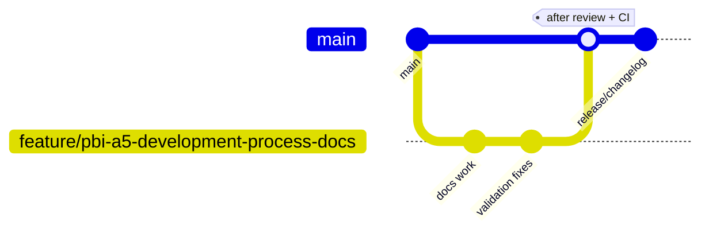

# Development and Configuration Process

This guide documents how the FaceGuard team currently plans work, develops features, reviews changes, configures each service, and prepares releases. It is written to match the workflow visible in the repository, project board, issue tracking, CI workflows, and release history.

## 1. Planning and Sprint Execution

### Product Backlog refinement

Backlog refinement turns broad product needs into work that is small enough to implement during a Sprint. In practice, the team:

- starts from user stories, MVP goals, QA findings, and stakeholder feedback;
- breaks larger stories into smaller PBIs with clear acceptance criteria;
- records the result as GitHub issues that can be estimated, assigned, and traced to evidence later;
- keeps issue text specific enough that implementation, review, and release evidence can all point back to the same artifact.

A refined issue should already explain the expected behavior, the documentation impact, and the checks that must pass before merge.

### Sprint Planning

During Sprint Planning, the team selects refined backlog items that fit the Sprint goal and current capacity. Each selected item should have:

- a GitHub issue with acceptance criteria;
- a responsible implementer;
- a reviewer who is not the implementer;
- a place on the GitHub Project board;
- a plan for how evidence will be captured before the Sprint closes.

The development branch is created only after the issue is ready to be worked on.

## 2. GitHub Project statuses

The project board is used to show where each issue sits in the delivery flow. In the current team workflow, items move through planning, active work, review, and delivery states. The statuses used in project materials and issue tracking are:

- **Planned** - refined work that is ready for a Sprint or queued for later;
- **In Progress** - implementation is active and a working branch exists;
- **In Review** - a pull request is open, feedback is being addressed, or CI is still being cleared;
- **Delivered** - the change is merged, documented, and preserved as Sprint evidence.

Issue `#60` itself was tracked as `In Progress` while this documentation was being prepared, which matches that delivery model.

## 3. Branch naming rules

All implementation starts from `main`.

The repository history shows the team mainly uses `feature/` branches, even for QA and documentation work. Branch names should:

- begin from `main`;
- use a descriptive prefix, normally `feature/`;
- include the related backlog, story, or scope name;
- stay readable in GitHub and CI logs;
- avoid vague names such as `test`, `new`, or `fix1`.

Examples already present in the repository include:

- `feature/us09-events-page`
- `feature/PBI-13-improve-people-table-styling`
- `feature/a4-quality-gates-48`
- `feature/pbi-a5-development-process-docs`

A good pattern is `feature/<ticket-or-scope>` in kebab case whenever possible.

## 4. Delivery workflow

The standard workflow is:

1. create or refine a GitHub issue;
2. create a branch from `main`;
3. implement the change and keep commits scoped to the issue;
4. run local validation before opening review;
5. open a pull request linked to the issue;
6. request an independent reviewer;
7. resolve review comments and rerun validation if needed;
8. wait for all required CI checks to pass;
9. merge to `main`;
10. update release evidence and changelog if the change affects a delivered version.

This keeps the issue, branch, pull request, CI output, and release notes tied together.

### Mermaid overview

The graph shows the intended path: work starts on a short-lived feature branch, review happens before merge, and `main` remains the source of releases.

## 5. Independent review requirement

Every change must be reviewed by someone other than the author before merge. Independent review is required because FaceGuard combines backend logic, recognition behavior, data handling, and deployment configuration. A second reviewer helps catch:

- missed acceptance criteria;
- unsafe configuration changes;
- undocumented environment variable changes;
- CI regressions;
- merge-ready issues that still need evidence or changelog updates.

The reviewer checks both the implementation and the linked issue context, not only the diff.

## 6. Required CI checks and Definition of Done

The repository currently defines two GitHub Actions workflows:

- `.github/workflows/quality.yml`
- `.github/workflows/links.yml`

The required quality checks documented in the workflow include:

- `backend-build`
- `backend-lint`
- `backend-tests`
- `quality-requirement-tests`
- `compose-validation`
- link checking through the `Check links` workflow
- the critical coverage verification script run from backend test output

### Definition of Done

A work item is done only when all of the following are true:

- acceptance criteria are implemented;
- the issue, branch, and PR are linked clearly;
- an independent reviewer has approved the change;
- required CI checks are green;
- configuration changes are documented;
- documentation is updated when behavior or setup changed;
- no secrets were committed;
- changelog and release notes are updated when the delivered product changed.

For documentation-only tasks, the same review and link-check expectations still apply.

## 7. Release and changelog process

`main` is the branch that represents releasable state. After a reviewed and validated change is merged:

- release notes are prepared from what was delivered in the Sprint;
- `CHANGELOG.md` is updated to capture user-visible changes;
- the release is tagged from a reviewed state on `main`;
- the Sprint report and release evidence should point to the same merged work.

The current repository already reflects this process through published changelog entries such as `v1.0.0` and `v1.0.1`.

## 8. Local development and configuration

This section separates safe public defaults from private values that must stay out of Git.

### 8.1 Backend service

The backend lives in `backend-service/` and ships with `backend-service/.env.example`.

Public development defaults currently include:

- `APP_NAME=FaceGuard API`
- `APP_VERSION=0.1.0`
- `APP_ENV=development`
- `DATABASE_URL=postgresql://faceguard:faceguard@db:5432/faceguard`
- `DATA_DIR=/data`
- `JWT_ALGORITHM=HS256`
- `ACCESS_TOKEN_EXPIRE_MINUTES=30`

The sample `SECRET_KEY` in `.env.example` is only a placeholder. It must be replaced in real environments and never reused in production.

#### Backend Docker Compose

`backend-service/docker-compose.yml` currently defines:

- a PostgreSQL database service exposed on port `5432`;
- a backend API service exposed on port `8000`;
- a bind mount `./app:/app/app` for live code editing;
- a bind mount `./data:/data` for backend persistent files;
- a named volume `postgres_data:/var/lib/postgresql/data` for database persistence.

These defaults are safe for local development because they are public, reproducible, and easy to replace.

### 8.2 Database

The database configuration is part of the backend compose stack.

Current public local defaults are:

- database image: `postgres:16-alpine`;
- database name: `faceguard`;
- database user: `faceguard`;
- database password: `faceguard`;
- local port mapping: `5432:5432`.

Those values are acceptable for local development only. Production credentials must be stored outside Git and injected through deployment secrets or private `.env` files.

### 8.3 Frontend

The administrator web application lives in `frontend/faceguard-web/`.

Current local setup is intentionally simple:

1. install dependencies with `npm i`;
2. start development mode with `npm run dev`.

`frontend/faceguard-web/.env.example` is reserved for frontend-specific variables. If the frontend later needs API base URLs, feature flags, or deployment-specific configuration, those defaults should be documented there instead of being hard-coded.

### 8.4 Recognition agent

The local recognition and camera agent lives in `agent/`.

`agent/docker-compose.yml` currently uses these public development defaults:

- `BACKEND_URL=${BACKEND_URL:-http://backend:8000}`
- `DEVICE_CODE=${DEVICE_CODE:-pi-main-001}`
- `HARDWARE_MODE=${HARDWARE_MODE:-development}`
- `RECOGNITION_THRESHOLD=${RECOGNITION_THRESHOLD:-70}`
- `LOG_LEVEL=${LOG_LEVEL:-INFO}`

Important runtime configuration details:

- `./data:/app/data` keeps agent data persistent between restarts;
- `/dev/video0:/dev/video0` passes through the camera device on Linux hosts;
- `privileged: true` is enabled for hardware access such as Raspberry Pi GPIO use cases;
- the compose file expects the external Docker network `faceguard_network`.

When testing locally without real hardware, the team should keep `HARDWARE_MODE=development` and use a non-secret sample `DEVICE_CODE`.

## 9. Public defaults vs private secrets

### Safe to keep in `.env.example` or committed compose files

- local ports such as `8000` and `5432`;
- sample service names;
- development database hostnames;
- placeholder device codes;
- non-sensitive log levels and thresholds;
- bind mounts and named volume definitions.

### Must stay private

- production `SECRET_KEY` values;
- real database passwords;
- production-only backend URLs if they expose private infrastructure;
- any API keys, access tokens, or cloud credentials;
- device credentials or secrets unique to a deployed agent.

Private values belong in untracked `.env` files, GitHub secrets, or the deployment platform's secret store.

## 10. Practical checklist for new contributors

Before starting work:

- pull the latest `main`;
- confirm the issue has acceptance criteria;
- create a branch from `main`;
- copy `.env.example` files into local private `.env` files when needed;
- verify required ports are free.

Before requesting review:

- run the relevant local checks;
- confirm documentation is updated;
- confirm no secrets were introduced;
- make sure the issue, branch, and PR reference one another.

Before merge:

- get independent approval;
- ensure required CI checks pass;
- update `CHANGELOG.md` if the release output changed.
