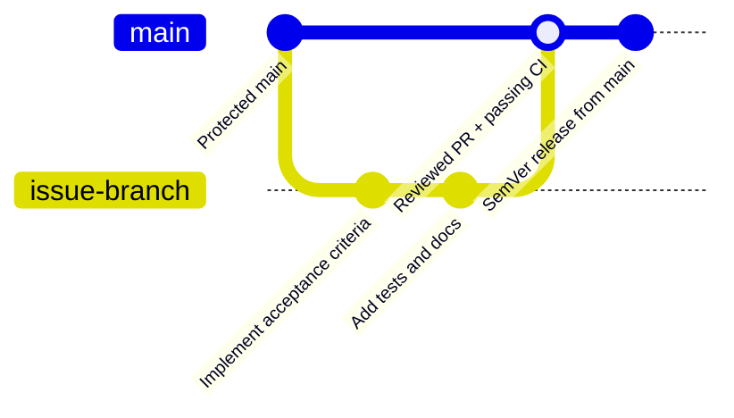

# Development Process and Configuration Management

This document is the maintained source of truth for the FaceGuard development
workflow and public configuration rules.

## Backlog and Planning

The Product Backlog is maintained in GitHub Issues and the organization
Project. Sprint scope is represented by a Sprint milestone, while SemVer
releases represent published increments after review and CI evidence exist.

Every ready Sprint PBI is expected to have:

- expected outcome;
- acceptance criteria;
- Story Points;
- implementer;
- different reviewer;
- Work Status;
- Sprint milestone.

Sprint 3 MVP v2 PBIs are tracked by:

- [#59 - PBI-A5-ARCH](https://github.com/Innopolis-Robotics-Society/FaceGuardV1/issues/59)
- [#60 - PBI-A5-PROC](https://github.com/Innopolis-Robotics-Society/FaceGuardV1/issues/60)
- [#61 - PBI-A5-QA](https://github.com/Innopolis-Robotics-Society/FaceGuardV1/issues/61)
- [#62 - PBI-A5-DELIVERY](https://github.com/Innopolis-Robotics-Society/FaceGuardV1/issues/62)
- [#35 - BUG-01: Recognition agent requires restart after authorized-person changes](https://github.com/Innopolis-Robotics-Society/FaceGuardV1/issues/35)
- [#58 - BUG-02: Recognition confidence is displayed in reverse](https://github.com/Innopolis-Robotics-Society/FaceGuardV1/issues/58)

## Work Status Flow

The GitHub Project Work Status is the public planning state. The usual flow is
`To Do` -> `In Progress` -> `In Review` -> `Done`. An item stays open when
required CI, independent review, customer evidence, release evidence, or
deployment evidence is missing.

## Branches, PRs, and Review

Branches are issue-linked and focused. Current Sprint 3 / Assignment 5 branch names are:

- `docs/a5-architecture`
- `docs/a5-development-process`
- `qa/a5-mvp-v2`
- `docs/a5-delivery`

Pull requests must link the issue, describe acceptance-criteria coverage, list
validation results, request the assigned independent reviewer, and merge only
after required checks pass. The team does not self-approve PRs.



The graph shows the intended repository path: main remains protected, focused
work happens on an issue branch, tests and documentation travel with the change,
review and CI gate the merge, and releases are created from main after merge.

## Definition of Done

The active Definition of Done is maintained in
[definition-of-done.md](definition-of-done.md). It requires issue-linked PRs,
independent review, green CI, relevant tests, updated documentation, changelog
entries, public/private evidence separation, and release/deployment evidence
when applicable.

## CI and Quality Gates

The maintained quality workflow includes:

- frontend production build;
- frontend recognition-score helper tests;
- backend Ruff lint;
- backend tests with coverage and critical-module coverage check;
- automated Quality Requirement Tests;
- Docker Compose configuration validation;
- strict MkDocs documentation build.

Assignment 4 gates remain active and must not be weakened to make later work
pass.

## Release and Changelog

User-visible changes are recorded in
[CHANGELOG.md](https://github.com/Innopolis-Robotics-Society/FaceGuardV1/blob/main/CHANGELOG.md).
Releases are SemVer tags prefixed with `v` and are created from protected
`main` only after selected changes are merged and required evidence exists.
If deployment, UAT, Sprint Review, or protected-main CI evidence is missing,
the release remains Pending.

## Configuration Management

### Frontend

The frontend lives in `frontend/faceguard-web`. It is built with Vite and reads
backend API settings from public development configuration. It must not expose
device-agent API keys, private deployment credentials, or customer data.

Development commands:

```bash
cd frontend/faceguard-web
npm ci
npm run build
npm test -- --run
```

### Backend and Database

The backend lives in `backend-service`. Docker Compose starts the backend and
PostgreSQL for local development. Persistent database data is managed through
Compose volumes and Alembic migrations.

Development commands:

```bash
cd backend-service
python -m pip install -r requirements-dev.txt
ruff check app/api/system.py app/core/security.py app/schemas/schemas.py tests scripts
pytest tests -v
pytest tests/qrt -m qrt -v
docker compose config --quiet
```

### Recognition Agent and Hardware

The agent lives in `agent`. In development it can use `HARDWARE_MODE=development`
and a local `CAMERA_INDEX`. The agent owns local SQLite buffering and local
recognition data under `agent/data` or configured runtime paths. The repository
must not contain generated biometric datasets, private camera images, or
customer-specific credentials.

### Ports and Persistent Data

Common local ports are:

| Component | Default local endpoint |
| --- | --- |
| Frontend | `http://localhost:5173` |
| Backend API | `http://localhost:8000` |
| PostgreSQL | `localhost:5432` through Compose |

Persistent data includes PostgreSQL volumes, agent SQLite queue files, uploaded
photo storage, and agent face/model artifacts. Backups and rollback plans must
cover database state and any runtime recognition dataset before production-like
changes.

## Public and Private Evidence

Public repository evidence may include issue/PR links, sanitized reports,
screenshots that do not expose credentials or customer identity, and validation
commands. Private Moodle evidence may include recording links, exact private
timecodes, consent evidence, private access instructions, and limited test
credentials. Private evidence must not be committed.
