# Week 2 Report - Face Guard

## Project

Face Guard is an access-control system for restricted rooms and protected areas. It provides an administrator interface for managing authorized people, reviewing access activity, and monitoring the system.

License: [MIT License](../../LICENSE)

## Required artifacts

| Artifact | Link |
|---|---|
| User stories and initial MVP v1 scope | [user-stories.md](./user-stories.md) |
| MVP v0 report and smoke check | [mvp-v0-report.md](./mvp-v0-report.md) |
| Customer meeting summary | [customer-meeting-summary.md](./customer-meeting-summary.md) |
| Sanitized customer meeting transcript | [customer-meeting-transcript.md](./customer-meeting-transcript.md) |
| Supplementary customer meeting notes | [customer-meeting-notes.md](./customer-meeting-notes.md) |
| Week 2 analysis | [analysis.md](./analysis.md) |
| LLM usage report | [llm-report.md](./llm-report.md) |

## Prototype and interface

The primary external interface is a graphical administrator web application.

- Interactive prototype: <https://www.figma.com/make/SRfKSsmTXU7thEWzW2f78g/FaceGuard-Admin-Panel-Design?t=QgeFJjbXiSSuzG8h-1>
- Runnable frontend source: [frontend/faceguard-web](../../frontend/faceguard-web/)
- Public frontend deployment: <https://innopolis-robotics-society.github.io/FaceGuardV1/>

### Dashboard

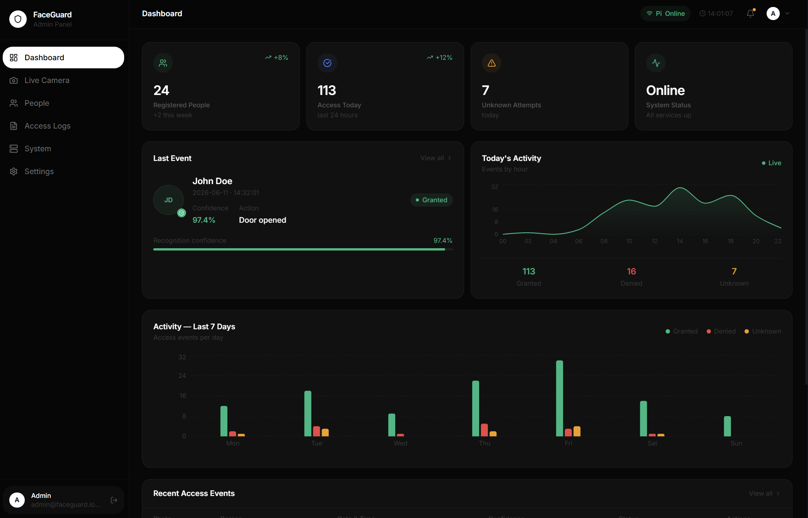

### People

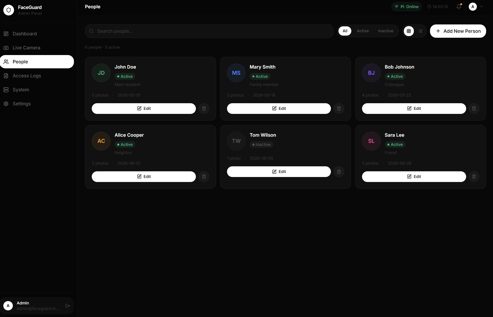

### Access logs

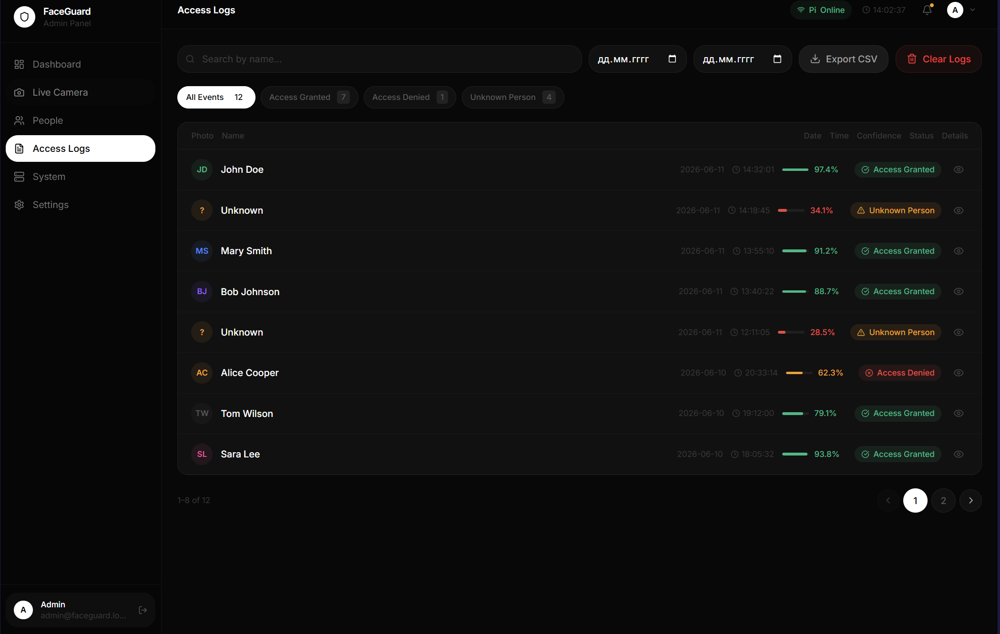

### System

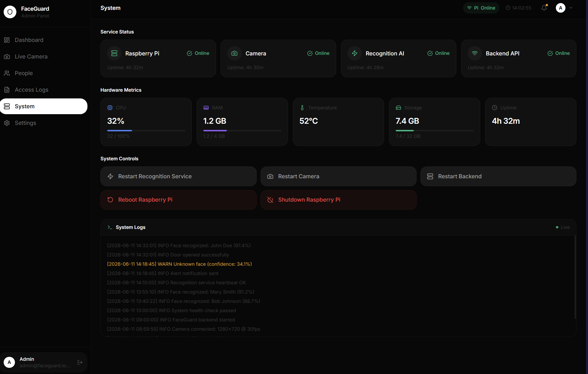

### Settings

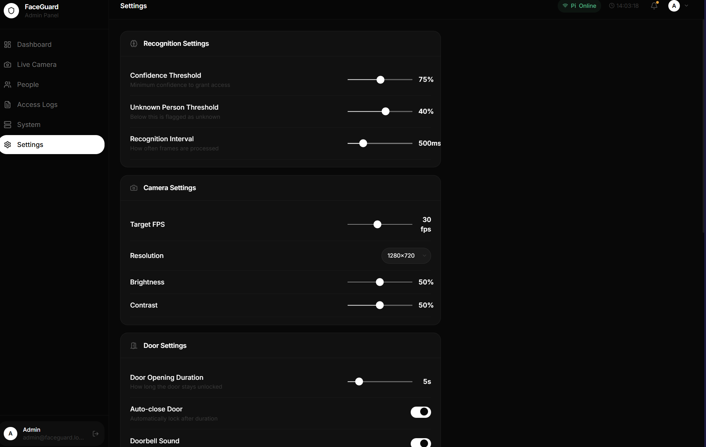

## MVP v0

- University VM deployment: <http://10.90.138.70:3000>
- Public GitHub Pages deployment: <https://innopolis-robotics-society.github.io/FaceGuardV1/>
- Public video demonstration: <https://disk.yandex.ru/i/cgaJVBhka7gISw>
- Local setup instructions: [frontend web README](../../frontend/faceguard-web/README.md)
- Detailed report and repeatable smoke check: [mvp-v0-report.md](./mvp-v0-report.md)

## Repository workflow

- Pull request template: [.github/pull_request_template.md](../../.github/pull_request_template.md)
- Example reviewed pull requests: [PR #7](https://github.com/Innopolis-Robotics-Society/FaceGuardV1/pull/7), [PR #9](https://github.com/Innopolis-Robotics-Society/FaceGuardV1/pull/9), [PR #10](https://github.com/Innopolis-Robotics-Society/FaceGuardV1/pull/10), [PR #11](https://github.com/Innopolis-Robotics-Society/FaceGuardV1/pull/11) - Lychee configuration: [.lychee.toml](../../.lychee.toml)
- Link-check workflow: [.github/workflows/links.yml](../../.github/workflows/links.yml)
- Link-check runs: <https://github.com/Innopolis-Robotics-Society/FaceGuardV1/actions/workflows/links.yml>
- GitHub Pages workflow: [.github/workflows/deploy-pages.yml](../../.github/workflows/deploy-pages.yml)
- GitHub Pages runs: <https://github.com/Innopolis-Robotics-Society/FaceGuardV1/actions/workflows/deploy-pages.yml>
- Latest successful link-check run on main: https://github.com/Innopolis-Robotics-Society/FaceGuardV1/actions/runs/27501443032

## Excluded Lychee links

| Link type | Reason | Manual verification |
|---|---|---|
| Private IP addresses, including `10.90.138.70` | Automated GitHub-hosted runners cannot access services inside the university network or VPN. `.lychee.toml` uses `exclude_all_private = true`. | Open the VM URL while connected to the university network or VPN and complete the documented smoke check. |
| Figma and Yandex Disk links | These services may block or rate-limit automated link-checking clients. | Open both links in a private browser window and confirm view-only access before submission. |
| Unsplash attribution links | Unsplash returns HTTP 401 to the automated client. | Open the attribution links manually when reviewing archived prototype materials outside the current repository tree. |
| GitHub Pages deployment URL | The URL returns 404 until the first deployment from `main`, creating a circular dependency for the PR check. | Verify the URL after the Pages workflow succeeds on `main`. |
| `frontend/faceguard-web/index.html` | The Vite app references web-root assets that are resolved at runtime by the frontend build. | Verify the active frontend with `frontend/faceguard-web` build instructions. |

All other repository Markdown and HTML links are checked automatically by Lychee. The excluded links require the manual checks described above. HTTP 429 is accepted because some public services rate-limit automated checks.

## Coverage

The initial proposed MVP v1 scope is **US-01, US-02, and US-03**.

| Artifact or screen | Covered stories | Purpose |
|---|---|---|
| Dashboard | US-03 | Displays system and access-control summary information. |
| People list | US-01 | Displays authorized people in one interface. |
| Add-person flow | US-02 | Demonstrates entry of a new authorized person. |
| Shared layout and navigation | US-01, US-02, US-03 | Connects the selected administrator workflow. |

The prototype also explores later stories:

- System page: US-05
- Access Logs page: US-09
- People edit/removal flow: US-10
- Responsive administrator interface: US-07 and US-08

## Customer review

- Meeting summary: [customer-meeting-summary.md](./customer-meeting-summary.md)
- Sanitized English transcript: [customer-meeting-transcript.md](./customer-meeting-transcript.md)
- Detailed supplementary notes: [customer-meeting-notes.md](./customer-meeting-notes.md)

Permission to record was obtained before recording began. Permission for private instructor sharing and publication of the sanitized English transcript was also confirmed.

## Screenshots and Evidence

The following screenshots document the repository workflow, pull request review process, deployment pipeline, and the running MVP v0 web client.

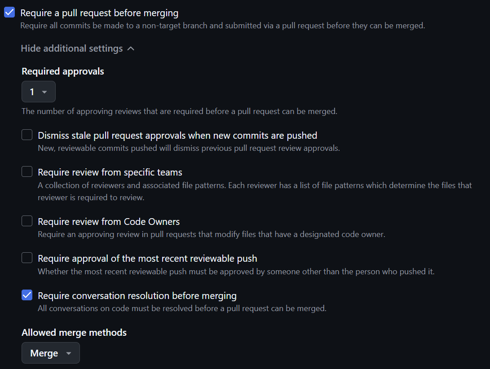

**Figure 1. Branch protection rules.** The repository is configured to require pull requests before merging into `main`, at least one approving review, and conversation resolution before merge. This protects the main branch from direct unreviewed changes.

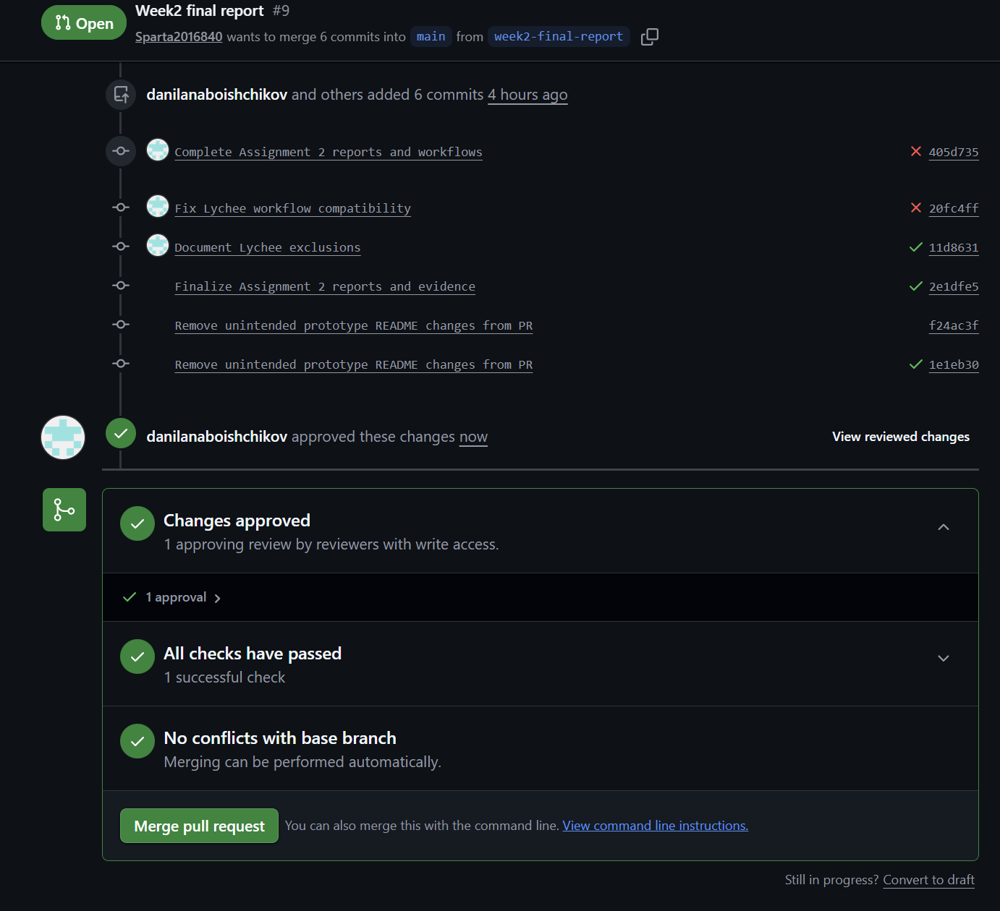

**Figure 2. Approved final Week 2 report pull request.** Pull request #9 was approved by a reviewer with write access. The required checks passed and GitHub reported no conflicts with the base branch.

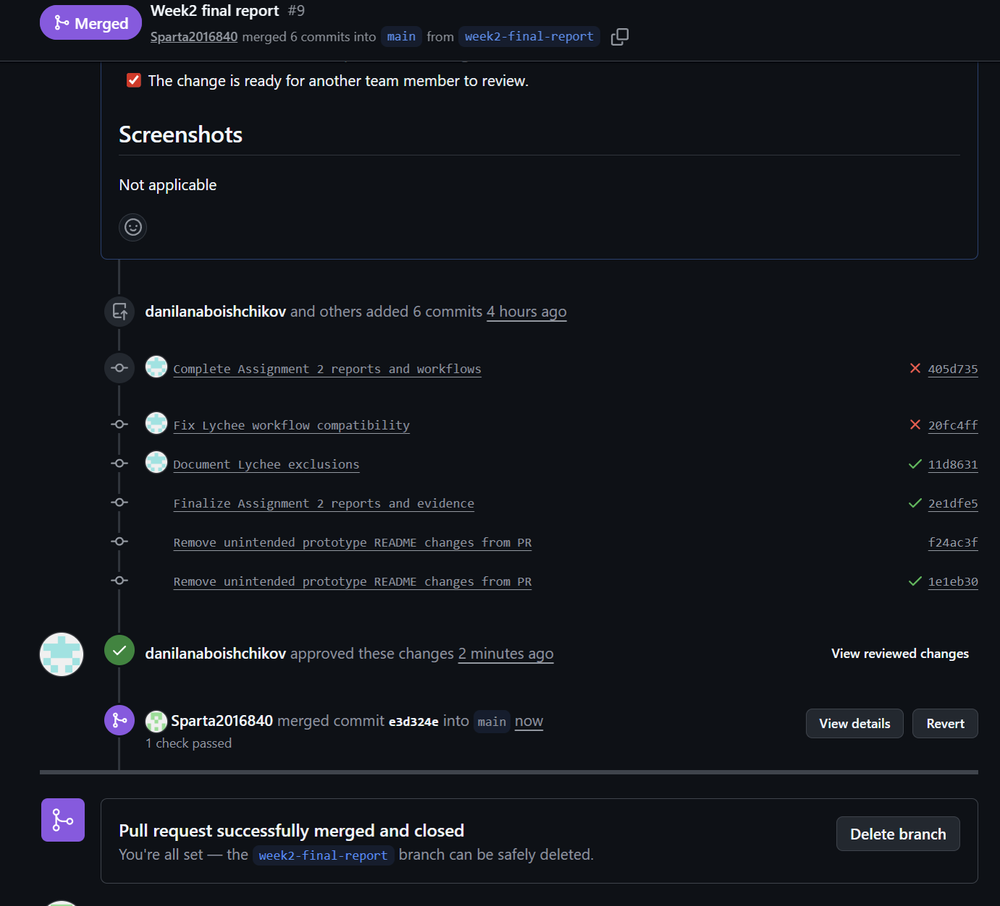

**Figure 3. Successfully merged final Week 2 report pull request.** The approved pull request was merged into the `main` branch after review and successful checks.

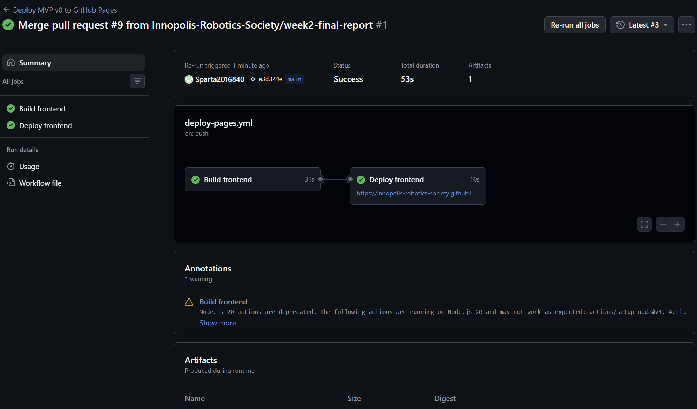

**Figure 4. GitHub Actions deployment result.** The deployment workflow completed successfully: the frontend build passed and the application was deployed to GitHub Pages.

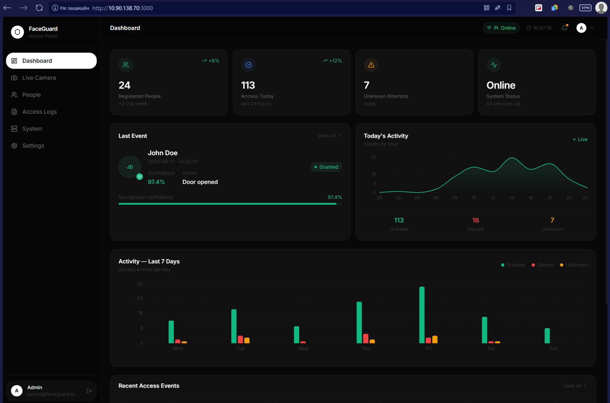

**Figure 5. MVP v0 running locally.** The FaceGuard admin dashboard is running in the local/internal network. The interface shows access statistics, system status, recent recognition activity, and access event charts.

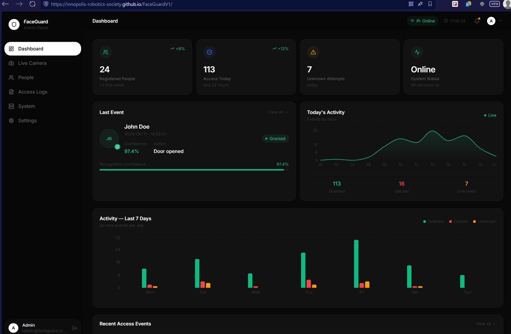

**Figure 6. MVP v0 deployed on GitHub Pages.** The deployed web client opens through the GitHub Pages URL and displays the FaceGuard dashboard successfully.

## Analysis

[Week 2 analysis](./analysis.md)

## LLM usage

[LLM usage report](./llm-report.md)
