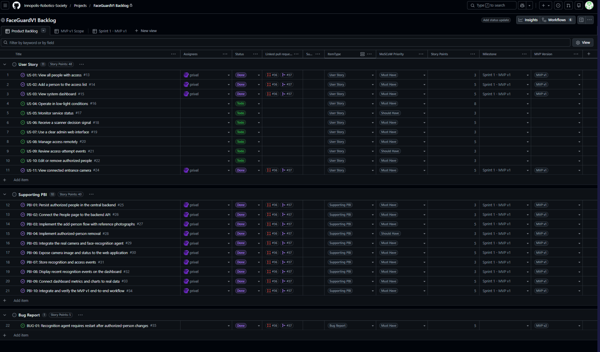
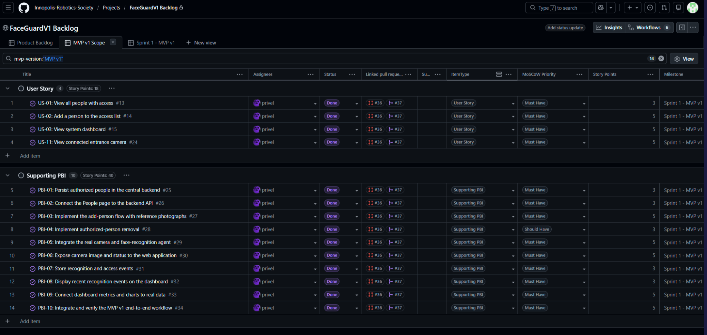
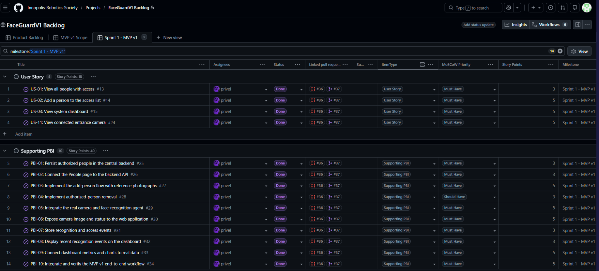
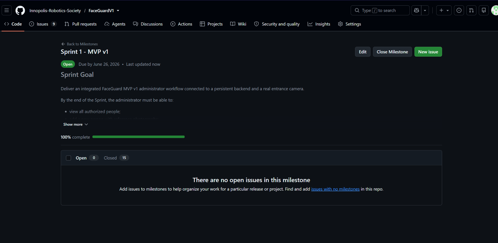

# Week 3 Report - FaceGuard

## 1. Project and License

FaceGuard is an access-control system for restricted rooms and protected areas. It combines an administrator web interface, a central backend service, persistent storage, a recognition agent, and a camera integration path.

License: [MIT License](../../LICENSE)

## 2. MVP v1 Scope and Change Since Assignment 2

Assignment 2 proposed a small MVP v1 scope: US-01, US-02, and US-03. During Assignment 3 backlog refinement, the team added US-11 because connected camera visibility was needed for a coherent end-to-end FaceGuard increment.

Current user-story index: [docs/user-stories.md](../../docs/user-stories.md)

## 3. Customer Feedback from Assignment 2 Addressed

- The two-outcome access model remains the working model: authorized people are granted access, unknown people are denied access.
- Revoked access removes a person from the authorized list rather than creating a separate blocked-identity state.
- Anti-spoofing remains outside MVP v1.
- MVP v1 implements the selected administrator flow, persistent authorized-person storage, camera visibility, recognition/access events, and dashboard data through [PR #37](https://github.com/Innopolis-Robotics-Society/FaceGuardV1/pull/37).

## 4. Historical Week 2 User Stories

[reports/week2/user-stories.md](../week2/user-stories.md)

## 5. Current User-Story Index

[docs/user-stories.md](../../docs/user-stories.md)

## 6. Product Backlog View

[Product Backlog view](https://github.com/orgs/Innopolis-Robotics-Society/projects/7/views/1)

The Product Backlog view should show all qualifying PBIs, including user stories and supporting PBIs. Course Tasks, removed PBIs, and `Won't Have` items do not count toward the required 15 qualifying PBIs.

## 7. Sprint Backlog View

[Sprint Backlog view](https://github.com/orgs/Innopolis-Robotics-Society/projects/7/views/2)

The Sprint Backlog view should be filtered to Sprint 1 / MVP v1 scope and should contain US-01, US-02, US-03, US-11, and PBI-01 through PBI-10.

## 8. Sprint Milestone, Dates and Sprint Goal

Milestone: [Sprint 1 - MVP v1](https://github.com/Innopolis-Robotics-Society/FaceGuardV1/milestone/1)

- Start date: June 21, 2026
- Finish date: June 26, 2026
- Sprint Goal: Deliver a basic administrator workflow with persistent people data, real dashboard data, and connected camera visibility.

## 9. Product Backlog Story Point Total

Current issue-backed Product Backlog total is 93 SP:

- US-01 through US-10 plus US-11: 48 SP
- PBI-01 through PBI-10: 40 SP
- BUG-01: 5 SP

## 10. Current Sprint Story Point Total

Selected Sprint 1 scope totals 58 SP:

- US-01, US-02, US-03, and US-11: 18 SP
- PBI-01 through PBI-10: 40 SP

## 11. MVP Version Grouped or Filtered View

[MVP v1 scope view](https://github.com/orgs/Innopolis-Robotics-Society/projects/7/views/3)

The MVP v1 grouped or filtered view should show the selected MVP v1 PBIs: US-01, US-02, US-03, US-11, and PBI-01 through PBI-10.

## 12. Selected MVP v1 Scope

- [US-01: View all people with access](https://github.com/Innopolis-Robotics-Society/FaceGuardV1/issues/13)
- [US-02: Add a person to the access list](https://github.com/Innopolis-Robotics-Society/FaceGuardV1/issues/14)
- [US-03: View system dashboard](https://github.com/Innopolis-Robotics-Society/FaceGuardV1/issues/15)
- [US-11: View connected entrance camera](https://github.com/Innopolis-Robotics-Society/FaceGuardV1/issues/24)
- [PBI-01: Persist authorized people in the central backend](https://github.com/Innopolis-Robotics-Society/FaceGuardV1/issues/25)
- [PBI-02: Connect the People page to the backend API](https://github.com/Innopolis-Robotics-Society/FaceGuardV1/issues/26)
- [PBI-03: Implement the add-person flow with reference photographs](https://github.com/Innopolis-Robotics-Society/FaceGuardV1/issues/27)
- [PBI-04: Implement authorized-person removal](https://github.com/Innopolis-Robotics-Society/FaceGuardV1/issues/28)
- [PBI-05: Integrate the real camera and face-recognition agent](https://github.com/Innopolis-Robotics-Society/FaceGuardV1/issues/29)
- [PBI-06: Expose camera image and status to the web application](https://github.com/Innopolis-Robotics-Society/FaceGuardV1/issues/30)
- [PBI-07: Store recognition and access events](https://github.com/Innopolis-Robotics-Society/FaceGuardV1/issues/31)
- [PBI-08: Display recent recognition events on the dashboard](https://github.com/Innopolis-Robotics-Society/FaceGuardV1/issues/32)
- [PBI-09: Connect dashboard metrics and charts to real data](https://github.com/Innopolis-Robotics-Society/FaceGuardV1/issues/33)
- [PBI-10: Integrate and verify the MVP v1 end-to-end workflow](https://github.com/Innopolis-Robotics-Society/FaceGuardV1/issues/34)

## 13. PBI Types, Statuses, Priorities, Milestone and Decomposition

The Product Backlog uses issue-based PBIs. User-story PBIs preserve stable IDs such as `US-01`; supporting PBIs are smaller backend, frontend, device-integration, testing, documentation, and release items linked to the selected user stories.

Each qualifying PBI should expose Type, Work Status, MoSCoW priority, Story Points, MVP version, milestone, assignee, and reviewer. Current Sprint items require acceptance criteria before they can be treated as Ready. MVP v1 items require at least three acceptance criteria, issue-linked PR evidence, verification evidence, and Done status.

## 14. Roadmap Summary

MVP v1 delivered the administrator flow, persistent people data, dashboard data, and connected camera visibility. The next Sprint should focus on recognition-model refresh, photo-capture limits, Ubuntu stabilization, and Raspberry Pi readiness.

Roadmap: [docs/roadmap.md](../../docs/roadmap.md)

## 15. Acceptance and Verification Evidence

- [PR #37: Deliver FaceGuard MVP v1 end-to-end integration fix](https://github.com/Innopolis-Robotics-Society/FaceGuardV1/pull/37) contains acceptance-criteria verification tables for US-01, US-02, US-03, US-11, and PBI-01 through PBI-10.
- [BUG-01 / issue #35](https://github.com/Innopolis-Robotics-Society/FaceGuardV1/issues/35) records the known limitation: recognition data requires restart/rebuild after authorized-person changes.
- Customer review feedback is documented in [customer-review-summary.md](./customer-review-summary.md).

## 16. Current Product Status

MVP v1 implementation was merged through PR #37. The customer accepted the demonstrated direction and said the result was more than expected. Remaining work is tracked as follow-up stabilization and bug-fix work, especially Ubuntu validation and recognition-model refresh.

## 17. Next Steps

- Stabilize and smoke-test the complete system on Ubuntu.
- Fix recognition-model refresh after authorized-person changes.
- Add a limit to repeated user-photo capture.
- Prepare Raspberry Pi deployment after Linux behavior is stable.
- Add final submission evidence: release, deployment/access link or runnable artifact, public demo link, and screenshots.

## 18. Contribution Traceability

| Team member | GitHub username | Issues / PBIs | PRs | Reviews and meaningful comments |
|---|---|---|---|---|
| Danila Naboishchikov | [Sparta2016840](https://github.com/Sparta2016840) | Reviewed US-01, US-02, PBI-01, PBI-02, PBI-03, PBI-04 | [PR #37](https://github.com/Innopolis-Robotics-Society/FaceGuardV1/pull/37) | Approved PR #37 with authorized-person management review |
| Emil Vagizov | [etherealboop](https://github.com/etherealboop) | Reviewed US-11, PBI-05, PBI-06 | [PR #37](https://github.com/Innopolis-Robotics-Society/FaceGuardV1/pull/37) | Approved PR #37 with camera and recognition-agent review |
| Eldar Bayazitov | [rmxqwo](https://github.com/rmxqwo) | Reviewed US-03, PBI-07, PBI-08, PBI-09, PBI-10 | [PR #37](https://github.com/Innopolis-Robotics-Society/FaceGuardV1/pull/37) | Approved PR #37 with dashboard, event, and integration review |
| Oleg Korchagin | [privel](https://github.com/privel) | Implemented US-01, US-02, US-03, US-11, PBI-01 through PBI-10 | [PR #37](https://github.com/Innopolis-Robotics-Society/FaceGuardV1/pull/37) | Main MVP v1 implementation author |

## 19. SemVer Release

Release notes for `v1.0.0` are prepared in [release-notes-v1.0.0.md](./release-notes-v1.0.0.md). The GitHub Release should be published as tag `v1.0.0` from the final Assignment 3 commit before Moodle submission.

## 20. Changelog

[CHANGELOG.md](../../CHANGELOG.md)

## 21. Process Requirements

The shared course Process Requirements are external course materials and should be linked or attached in the Moodle submission if they are not committed to the repository.

## 22. Definition of Done and Roadmap

- [docs/definition-of-done.md](../../docs/definition-of-done.md)
- [docs/roadmap.md](../../docs/roadmap.md)

## 23. Issue Templates and PR Template

- [User Story template](../../.github/ISSUE_TEMPLATE/user-story.md)
- [Other PBI template](../../.github/ISSUE_TEMPLATE/other-pbi.md)
- [Course Task template](../../.github/ISSUE_TEMPLATE/course-task.md)
- [Bug Report template](../../.github/ISSUE_TEMPLATE/bug-report.md)
- [Pull Request template](../../.github/pull_request_template.md)

## 24. Week 3 Reviewed PR Links

- [PR #37: Deliver FaceGuard MVP v1 end-to-end integration fix](https://github.com/Innopolis-Robotics-Society/FaceGuardV1/pull/37)

## 25. Deployment / Access Point

FaceGuard MVP v1 is a hardware-dependent system. The frontend and backend can be started from the repository using the documented commands, while the recognition agent runs locally on a team laptop in development mode with the laptop's built-in or USB camera.

This deployment model was selected because the customer recommended validating the recognition workflow with locally available laptop cameras before deploying a dedicated Raspberry Pi and fixed entrance camera.

The reproducible MVP v1 access point is:

- the `v1.0.0` GitHub Release once published;
- the source-code archive attached automatically to the release;
- exact local run instructions in the [root README](../../README.md);
- the public sanitized [MVP v1 demonstration video](https://drive.google.com/file/d/1ROzA_gZtCb6iZ-BpT2tHCJFFDoohaqqQ/view?usp=sharing);
- reviewed implementation evidence in [PR #37](https://github.com/Innopolis-Robotics-Society/FaceGuardV1/pull/37).

For laptop-camera testing:

```env
HARDWARE_MODE=development
CAMERA_INDEX=0
```

The camera and recognition agent are not exposed as a permanent public stream because they depend on local hardware and may process biometric data. The GitHub Pages website is retained only as a static frontend preview and is not presented as the complete MVP v1 deployment.

## 26. Root Run Instructions

[Root README](../../README.md)

## 27. Under-Two-Minute Public Demo

[MVP v1 public sanitized demonstration video](https://drive.google.com/file/d/1ROzA_gZtCb6iZ-BpT2tHCJFFDoohaqqQ/view?usp=sharing)

## 28. Required Screenshots from `images/`

The available Assignment 3 screenshots are embedded below.



**Figure 1. Product Backlog view.**



**Figure 2. MVP v1 scope view.**



**Figure 3. Sprint Backlog view.**



**Figure 4. Sprint 1 milestone.**

The live Project views are available at:

- [Product Backlog](https://github.com/orgs/Innopolis-Robotics-Society/projects/7/views/1)
- [Sprint Backlog](https://github.com/orgs/Innopolis-Robotics-Society/projects/7/views/2)
- [MVP v1 scope](https://github.com/orgs/Innopolis-Robotics-Society/projects/7/views/3)

The remaining screenshots to add after release/publication are the SemVer release, delivered MVP v1 evidence, and an example reviewed issue-linked PR.

## 29. Customer Review Transcript / Notes Handling

Customer review transcript: [customer-review-transcript.md](./customer-review-transcript.md)

Permission to record the meeting, publish the sanitized English transcript in the public repository, and share the review materials privately with instructors was obtained.

## 30. Customer Review Summary

[customer-review-summary.md](./customer-review-summary.md)

## 31. Reflection

[reflection.md](./reflection.md)

## 32. Retrospective

[retrospective.md](./retrospective.md)

## 33. LLM Report

[llm-report.md](./llm-report.md)
