# Week 4 Report - Assignment 4

## 1. Project Identification

- Project: FaceGuard
- Team number: not included in the public repository evidence reviewed on
  June 28, 2026.
- Repository: [Innopolis-Robotics-Society/FaceGuardV1](https://github.com/Innopolis-Robotics-Society/FaceGuardV1)
- Public report purpose: document the Assignment 4 / Week 4 increment, quality
  gates, Sprint evidence, and remaining submission work without exposing private
  customer or credential material.
- Assignment 4 increment: Sprint 2 - Increment.
- Report status: Assignment 4 release, protected-main CI, private-network
  deployment, customer review, customer scenario confirmation, and project
  presentation evidence are added.
- Latest evidence date: June 28, 2026.

## 2. Team

Team identity is reused from the maintained Week 3 report.

| Name | GitHub | Sprint role | Main responsibility |
| --- | --- | --- | --- |
| Danila Naboishchikov | [Sparta2016840](https://github.com/Sparta2016840) | Scrum Master / Developer | Assignment 4 QA gates, testing documentation, review of Dashboard refresh PR. |
| Emil Vagizov | [etherealboop](https://github.com/etherealboop) | Developer | US-09 access-events review implementation. |
| Eldar Bayazitov | [rmxqwo](https://github.com/rmxqwo) | Developer | US-10 authorized-person edit/removal implementation and PR review for US-09. |
| Oleg Korchagin | [privel](https://github.com/privel) | Developer | Dashboard refresh implementation and review of QA gates. |

## 3. Sprint Overview

- Milestone: [Sprint 2 - Increment](https://github.com/Innopolis-Robotics-Society/FaceGuardV1/milestone/2)
- Sprint dates: June 22, 2026 to June 29, 2026.
- Sprint Goal: Improve the FaceGuard administrator experience by completing
  access-log review, making person removal safer, adding clear Dashboard refresh
  feedback, and introducing automated quality requirements, tests, coverage
  enforcement, and CI quality gates.
- Selected scope: issues #21, #22, #47, and #48.
- Selected scope total: 10 Story Points.
- Milestone progress at latest evidence collection: selected Sprint issues #21,
  #22, #47, and #48 are closed through merged PRs. The broader Sprint 2
  milestone may still contain other open issues.

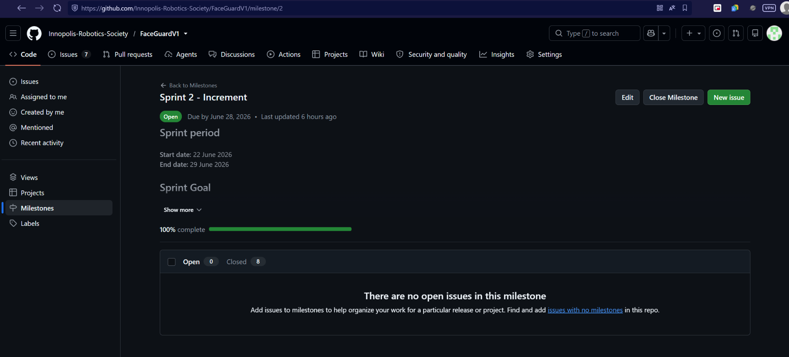

*Caption: Sprint 2 milestone evidence showing the sprint dates and 100%
completion for the milestone view.*

## 4. Sprint Backlog Traceability

The selected Sprint scope consists of Issues #21, #22, #47, and #48. The
Project view may also show linked Pull Requests, but those pull-request rows are
implementation evidence and are not counted as additional PBIs.

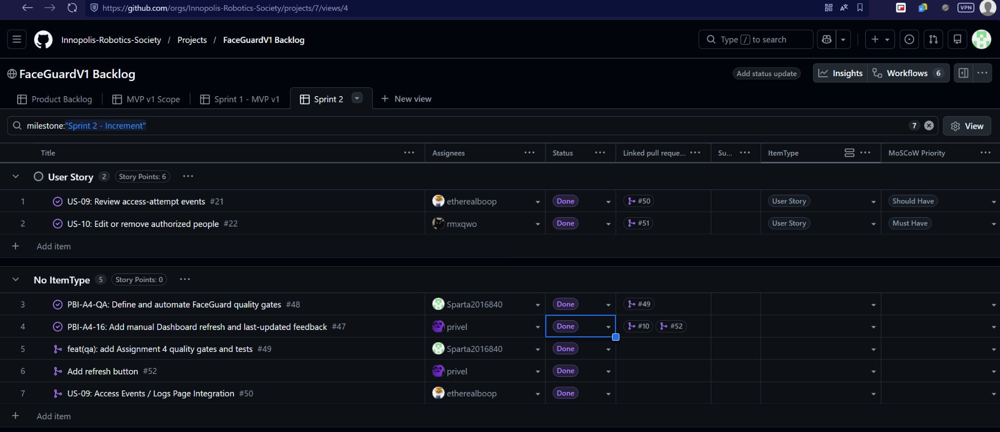

*Caption: Sprint 2 Project view showing selected issue rows and their linked
implementation pull requests.*

| PBI | Outcome | SP | Implementer | Reviewer | Issue | PR | Current status |
| --- | --- | ---: | --- | --- | --- | --- | --- |
| US-09: Review access-attempt events | Access Logs should show timestamp, granted/denied/unknown result, person or Unknown, device/location, filters, newest-first ordering, and 25-item pagination. | 3 | [etherealboop](https://github.com/etherealboop) | [rmxqwo](https://github.com/rmxqwo) | [#21](https://github.com/Innopolis-Robotics-Society/FaceGuardV1/issues/21) | [#50](https://github.com/Innopolis-Robotics-Society/FaceGuardV1/pull/50) | Delivered; merged to `main` on June 28, 2026. |
| US-10: Edit or remove authorized people | People records should support edit, notes/photo update, safe typed delete confirmation, success feedback, and immediate list update. | 3 | [rmxqwo](https://github.com/rmxqwo) | [etherealboop](https://github.com/etherealboop) | [#22](https://github.com/Innopolis-Robotics-Society/FaceGuardV1/issues/22) | [#51](https://github.com/Innopolis-Robotics-Society/FaceGuardV1/pull/51) | Delivered; merged to `main` on June 28, 2026. |
| PBI-A4-16: Dashboard refresh | Dashboard has a manual refresh action and last-updated feedback. | 1 | [privel](https://github.com/privel) | [Sparta2016840](https://github.com/Sparta2016840) | [#47](https://github.com/Innopolis-Robotics-Society/FaceGuardV1/issues/47) | [#52](https://github.com/Innopolis-Robotics-Society/FaceGuardV1/pull/52) | Delivered; merged to `main` on June 28, 2026. |
| PBI-A4-QA: Quality gates | Quality requirements, QRTs, unit/integration tests, coverage enforcement, and CI jobs are defined and automated. | 3 | [Sparta2016840](https://github.com/Sparta2016840) | [privel](https://github.com/privel) | [#48](https://github.com/Innopolis-Robotics-Society/FaceGuardV1/issues/48) | [#49](https://github.com/Innopolis-Robotics-Society/FaceGuardV1/pull/49) | Delivered; merged to `main` on June 28, 2026. |

## 5. Delivered Increment and Customer Confirmation

### Delivered to `main`

- [#47](https://github.com/Innopolis-Robotics-Society/FaceGuardV1/issues/47)
  via [PR #52](https://github.com/Innopolis-Robotics-Society/FaceGuardV1/pull/52):
  manual Dashboard refresh and last-updated feedback.
- [#48](https://github.com/Innopolis-Robotics-Society/FaceGuardV1/issues/48)
  via [PR #49](https://github.com/Innopolis-Robotics-Society/FaceGuardV1/pull/49):
  quality gates and tests.
- [#22](https://github.com/Innopolis-Robotics-Society/FaceGuardV1/issues/22)
  via [PR #51](https://github.com/Innopolis-Robotics-Society/FaceGuardV1/pull/51):
  authorized-person edit and safe removal.
- [#21](https://github.com/Innopolis-Robotics-Society/FaceGuardV1/issues/21)
  via [PR #50](https://github.com/Innopolis-Robotics-Society/FaceGuardV1/pull/50):
  Access Logs integration.

### Review Status

No selected Sprint scope PR is in review at the final evidence point. Issues
#21, #22, #47, and #48 are delivered through merged PRs.

### Customer Confirmation

The customer was sent the implemented scenario checklist after the review and
confirmed that the user stories are approved.

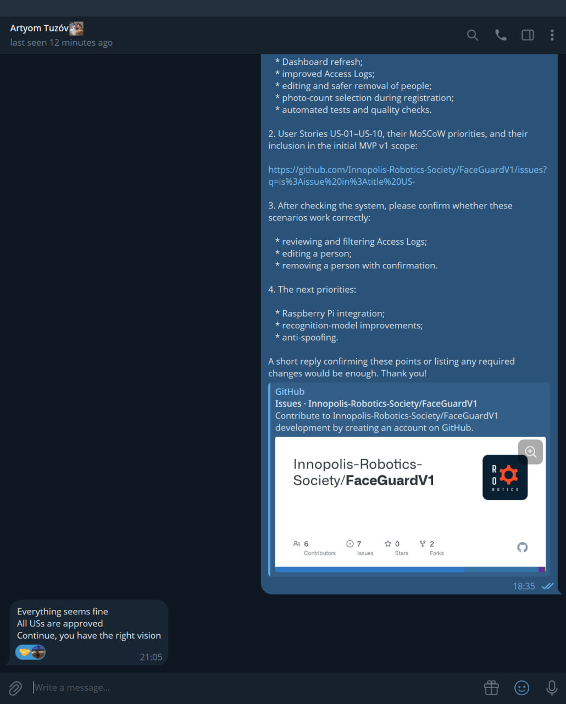

*Caption: Customer message confirming that everything seems fine, all user
stories are approved, and the team has the right vision.*

## 6. Customer and Stakeholder Feedback Response

| Feedback source | Feedback | Response | PBI/Issue | Status | Rationale |
| --- | --- | --- | --- | --- | --- |
| Customer Review | Hardware work and anti-spoofing are important next priorities. | Prioritize Raspberry Pi integration, recognition-model improvement, and anti-spoofing in the next Sprint. | Future Sprint scope | Planned | Confirmed in Week 4 customer review transcript. |
| Customer Follow-up | Customer checked the scenario list after the review and approved the user stories. | Preserve the written confirmation as public evidence. | UAT scenarios | Delivered | Confirmed in the customer message screenshot. |
| Course quality requirement | Assignment 4 requires measurable quality requirements, QRTs, tests, coverage, and CI. | Implement through QA gates PR. | [#48](https://github.com/Innopolis-Robotics-Society/FaceGuardV1/issues/48) | Delivered | Course requirement, not customer feedback. |
| Team-identified improvement | Dashboard needed clearer manual refresh feedback. | Implemented manual refresh and last-updated state. | [#47](https://github.com/Innopolis-Robotics-Society/FaceGuardV1/issues/47) | Delivered | Delivered through PR #52. |

## 7. Quality Requirements

Full documents:

- [Quality requirements](../../docs/quality-requirements.md)
- [Quality requirement tests](../../docs/quality-requirement-tests.md)

| QR | ISO/IEC 25010 characteristic | Sub-characteristic | Measure | QRT |
| --- | --- | --- | --- | --- |
| `QR-PERF-001` | Performance efficiency | Time behaviour | 20 health requests return HTTP 200 with `status: "ok"` and p95 below 1000 ms in TestClient CI measurement. | `QRT-PERF-001` |
| `QR-SEC-001` | Security | Authenticity | Missing and malformed administrator identity requests are rejected with HTTP 401 or 403 and expose no identity fields. | `QRT-SEC-001` |
| `QR-USE-001` | Usability | User error protection | Invalid person names are rejected; one-character and 255-character names are accepted. | `QRT-USE-001` |

## 8. Automated Testing

Testing guide: [docs/testing.md](../../docs/testing.md)

| Test group | Test files | Command | Current verified status |
| --- | --- | --- | --- |
| Unit tests | `backend-service/tests/unit/test_security.py` | `cd backend-service && pytest tests/unit -v` | Verified locally after this documentation update: 8 passed. |
| Integration tests | `backend-service/tests/integration/test_system_api.py` | `cd backend-service && pytest tests/integration -v` | Verified locally after this documentation update: 2 passed. |
| QRTs | `backend-service/tests/qrt/test_quality_requirements.py` | `cd backend-service && pytest tests/qrt -m qrt -v` | Verified in protected-main CI: [Quality requirement tests job](https://github.com/Innopolis-Robotics-Society/FaceGuardV1/actions/runs/28328689056/job/83922995234). |
| Frontend build | `frontend/faceguard-web` | `npm ci && npm run build` | Verified locally after this documentation update; Vite reported a large chunk warning. |

## 9. Critical-Module Coverage

The following values are from the protected-main
[Backend tests and critical coverage job](https://github.com/Innopolis-Robotics-Society/FaceGuardV1/actions/runs/28328689056/job/83922995205)
and the embedded coverage screenshot below.

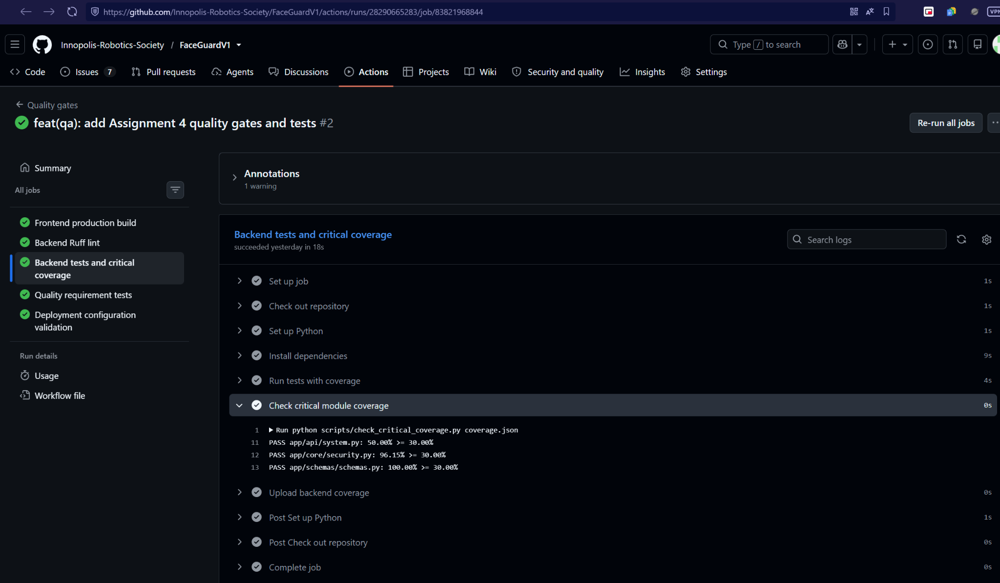

*Caption: Backend coverage gate output showing all documented critical modules
passing the required 30% minimum line coverage threshold.*

| Critical module | Required | Actual | Evidence |
| --- | ---: | ---: | --- |
| `app/api/system.py` | 30% | 50.00% | Protected-main backend tests and critical coverage job. |
| `app/core/security.py` | 30% | 96.15% | Protected-main backend tests and critical coverage job. |
| `app/schemas/schemas.py` | 30% | 100.00% | Protected-main backend tests and critical coverage job. |

## 10. CI and Additional QA

PR #49 adds these visible jobs in `.github/workflows/quality.yml`:

- `Frontend production build`
- `Backend Ruff lint`
- `Backend tests and critical coverage`
- `Quality requirement tests`
- `Deployment configuration validation`

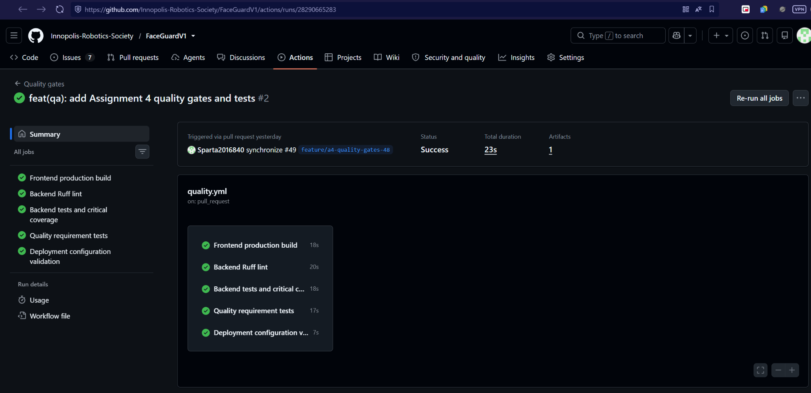

*Caption: PR #49 quality workflow with frontend build, Ruff lint, backend
tests and coverage, QRTs, and deployment configuration validation passing.*

The additional QA check is Docker Compose configuration validation:

```bash
docker compose -f backend-service/docker-compose.yml config --quiet
```

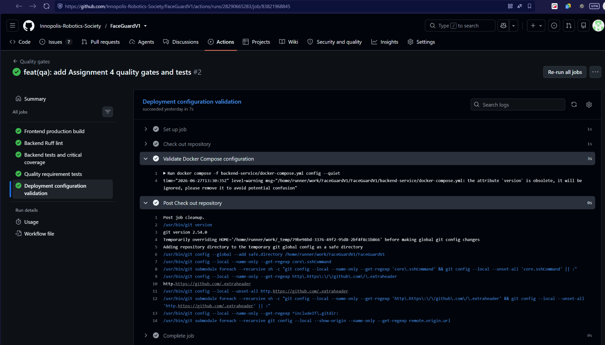

*Caption: Deployment configuration validation job completing successfully. The
Compose `version` warning is informational and did not fail the job.*

Lychee is link checking and is not counted as the additional QA check.

Protected-main CI evidence was captured after the Week 4 documentation merge:

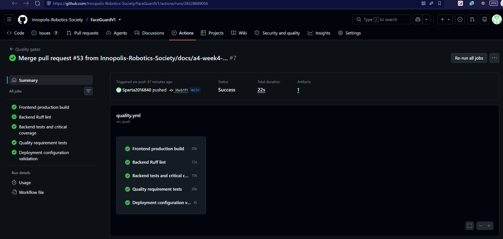

*Caption: Quality gates workflow triggered by a push to `main` after the Week 4
documentation merge; all five quality jobs passed.*

| Evidence type | Status | Evidence |
| --- | --- | --- |
| Successful PR CI | Delivered for PR #49 before this documentation commit | [Quality gates run](https://github.com/Innopolis-Robotics-Society/FaceGuardV1/actions/runs/28290665283) and [link-check run](https://github.com/Innopolis-Robotics-Society/FaceGuardV1/actions/runs/28290665286). |
| Successful protected-main CI | Delivered | [Quality gates run](https://github.com/Innopolis-Robotics-Society/FaceGuardV1/actions/runs/28328689056) triggered by a push to `main` after the Week 4 documentation merge; all five quality jobs passed. |
| Protected-main quality workflow | Delivered | `quality.yml` is active on `main` and passed after the documentation merge. |
| Quality requirement tests | Delivered | [Quality requirement tests job](https://github.com/Innopolis-Robotics-Society/FaceGuardV1/actions/runs/28328689056/job/83922995234). |
| Backend tests and critical coverage | Delivered | [Backend tests and critical coverage job](https://github.com/Innopolis-Robotics-Society/FaceGuardV1/actions/runs/28328689056/job/83922995205) and embedded coverage screenshot evidence. |
| Additional QA / Compose validation | Delivered | The [Docker Compose validation job](https://github.com/Innopolis-Robotics-Society/FaceGuardV1/actions/runs/28328689056/job/83922995206) ran `docker compose -f backend-service/docker-compose.yml config --quiet` successfully. |

## 11. Branch Protection and Definition of Done

Definition of Done: [docs/definition-of-done.md](../../docs/definition-of-done.md)

The Assignment 4 Definition of Done requires verified Acceptance Criteria,
issue-linked PRs, independent review, relevant tests, linked QRTs, per-critical
module coverage, CI, documentation, changelog updates, and evidence preservation.

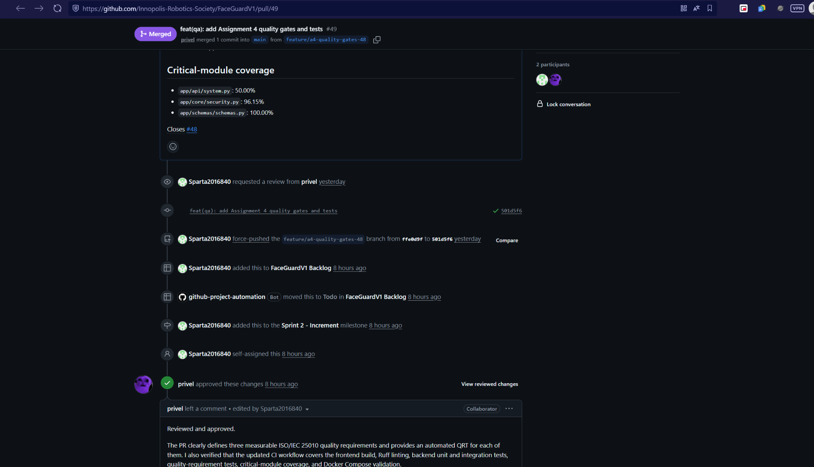

*Caption: PR #49 was reviewed and approved by another team member before merge.*

Branch ruleset evidence:

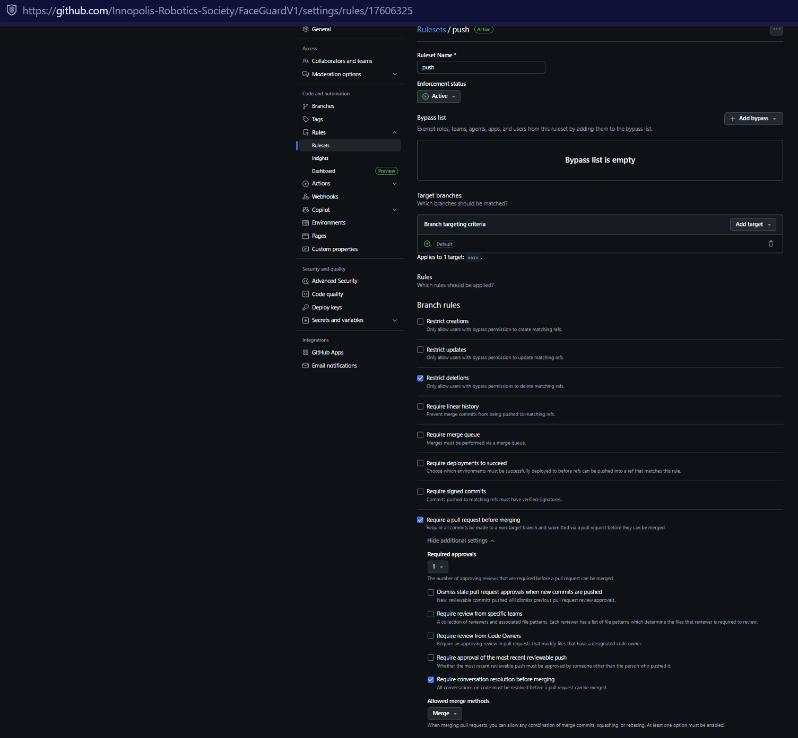

*Caption: Active repository ruleset applied to `main`, requiring a pull request
before merge, one approval, resolved conversations, and restricted branch
deletion.*

The screenshot supports only these branch-protection claims: active ruleset
applied to `main`, pull request required before merge, one required approval,
conversation resolution required, and branch deletion restricted. It is not used
as evidence for required status checks, signed commits, force-push protection,
or deployment requirements.

## 12. Deployment and Release

- Release status: Published.
- Current published release: [FaceGuard MVP v1 / v1.0.0](https://github.com/Innopolis-Robotics-Society/FaceGuardV1/releases/tag/v1.0.0), which belongs to Assignment 3.
- Assignment 4 release version: `v1.1.0`.
- Assignment 4 release title: `FaceGuard v1.1.0 — Assignment 4 Sprint Increment`.
- Assignment 4 release URL: [v1.1.0](https://github.com/Innopolis-Robotics-Society/FaceGuardV1/releases/tag/v1.1.0).
- Release notes: [release-notes-v1.1.0.md](release-notes-v1.1.0.md)
- Deployment URL: http://10.93.26.183:5173/
- Deployment status: customer-accessible deployment on the Innopolis
  University private network.

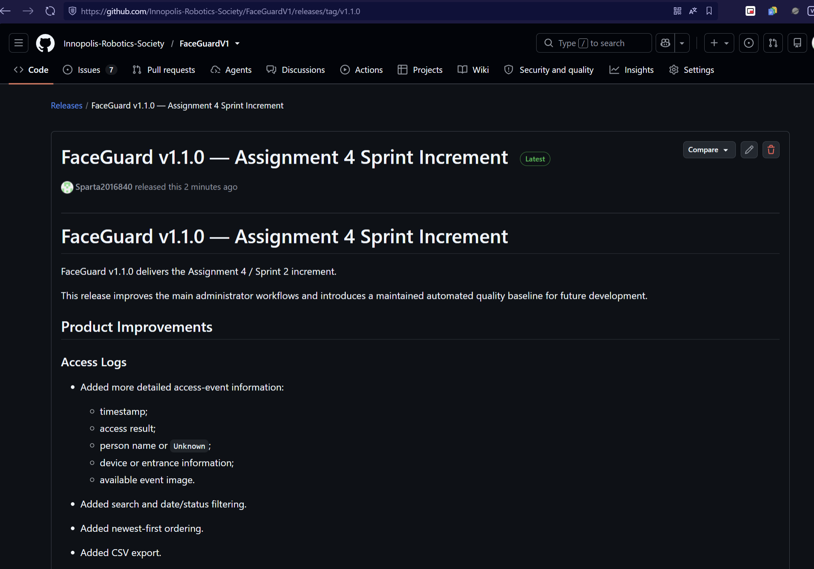

*Caption: Published GitHub Release for FaceGuard v1.1.0, the Assignment 4
Sprint increment.*

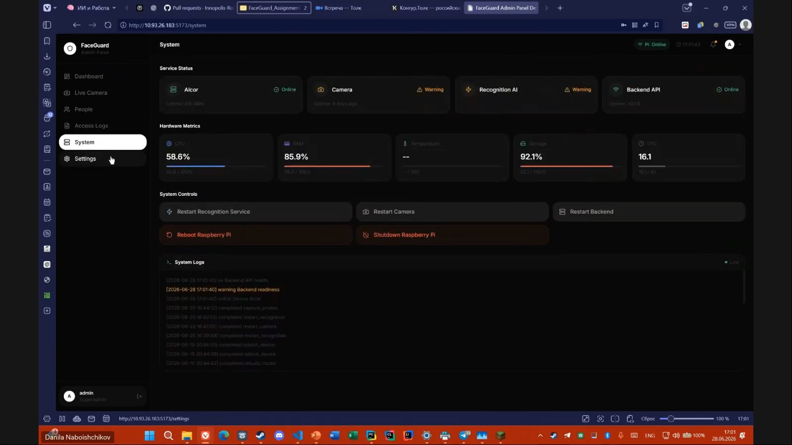

*Caption: Running FaceGuard deployment on the Innopolis University private
network showing system status and service health indicators.*

## 13. UAT

UAT scenarios: [docs/user-acceptance-tests.md](../../docs/user-acceptance-tests.md)

- Execution status: Customer Review completed; customer scenario confirmation
  received after the review.
- UAT results: The customer confirmed that the checked user stories are
  approved.

Access Logs evidence:

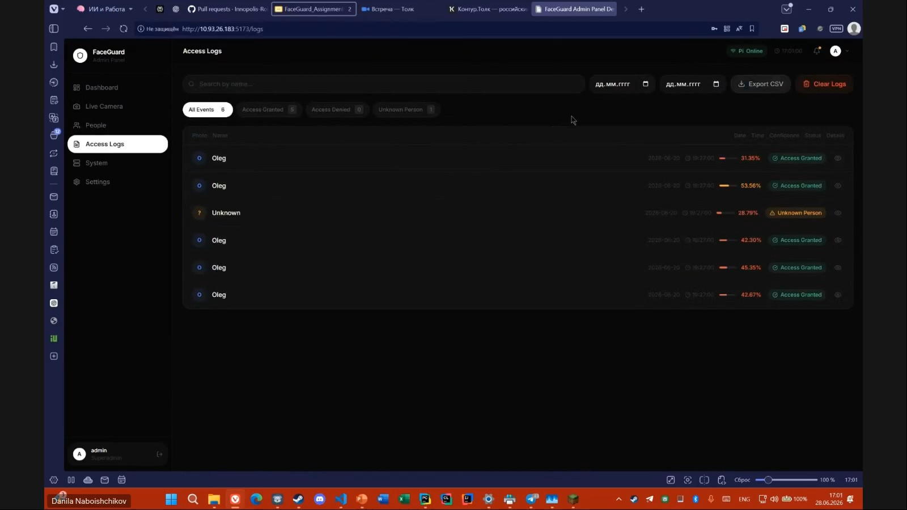

*Caption: Access Logs UI with search, date fields, status filters, event rows,
and CSV export.*

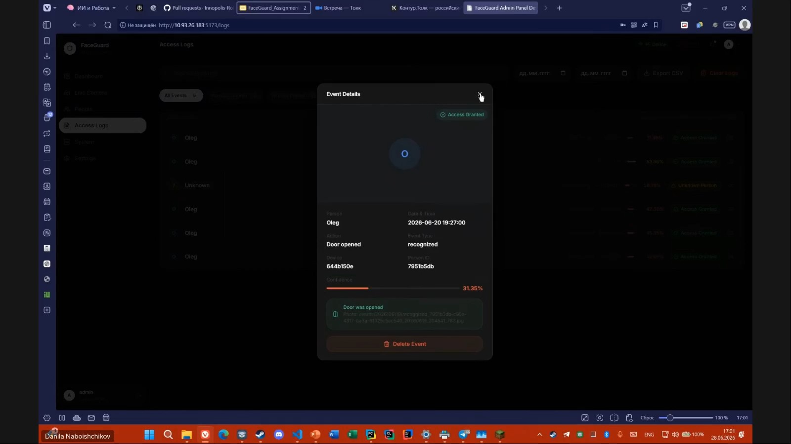

*Caption: Access event details modal showing person, time, confidence, decision,
device, event type, and event image reference.*

People workflow evidence:

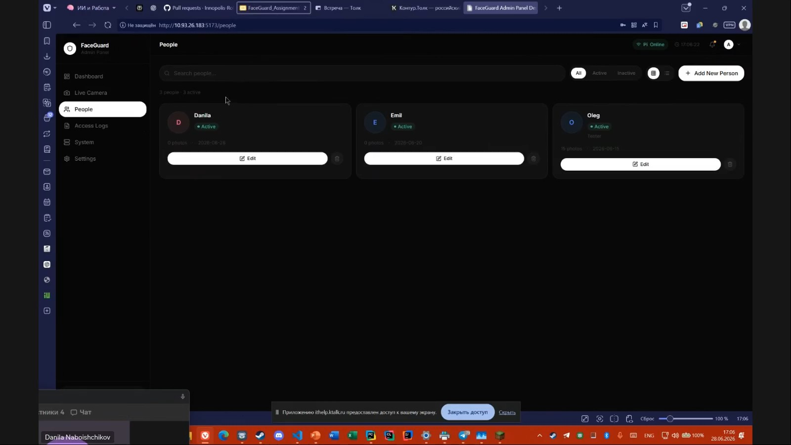

*Caption: People management page showing authorized users and edit actions.*

Reference-photo workflow evidence:

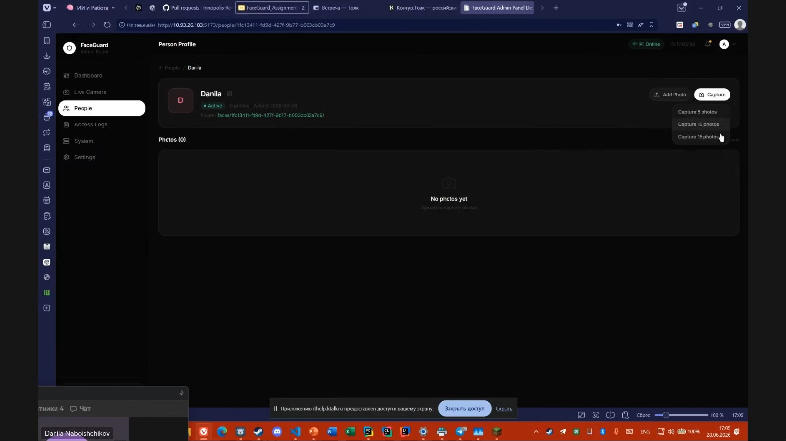

*Caption: Reference-photo capture menu offering 5, 10, or 15 photo capture
options for an authorized person.*

Dashboard evidence:

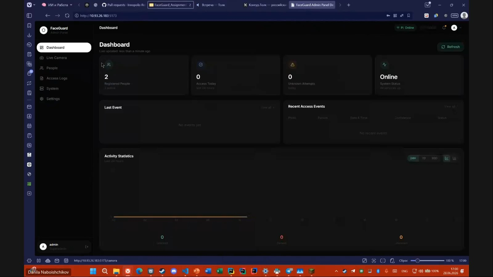

*Caption: Dashboard showing the manual Refresh action and last-updated
feedback.*

Customer confirmation evidence:


*Caption: Customer follow-up message approving the checked user stories,
including Access Logs review, person editing, and person removal with
confirmation.*

## 14. Sprint Review

- Status: Customer Review Completed.
- Summary template: [customer-review-summary.md](customer-review-summary.md)
- Sanitized transcript: [customer-review-transcript.md](customer-review-transcript.md)

The customer session took place on June 28, 2026. The team reports that Sprint
implementation and recording approval were obtained. Restricted recording links
and access details are kept out of the public repository.

## 15. Retrospective

Retrospective: [retrospective.md](retrospective.md)

The current retrospective focuses on evidence from GitHub: small Sprint PBIs,
parallel implementation, issue-linked PRs, automated quality gates, late report
preparation, merge timing, and CI evidence gaps near submission.

## 16. Reflection

Reflection: [reflection.md](reflection.md)

The reflection explains the shift from a functional MVP toward a
quality-controlled increment and records customer-confirmed UAT evidence.

## 17. LLM Usage

LLM report: [llm-report.md](llm-report.md)

The report documents Codex-assisted repository inspection, documentation
drafting, traceability extraction, and consistency review.

## 18. Public Demo and Presentation

- Project presentation video: [Five-minute project presentation](https://drive.google.com/file/d/1sdwue996O--n4EDrhZsA01T88WiFIMfv/view?usp=sharing)

## 19. Screenshot Evidence

The report embeds all public Week 4 screenshot evidence from
`reports/week4/images/`, including Sprint planning, backlog, reviewed PRs, CI,
coverage, branch rules, release, deployment, delivered product screens, and
customer confirmation.

## 20. Contribution Traceability

Evidence source: GitHub Issues, PRs, commits, files, and review records checked
on June 28, 2026. Requested reviews are not counted as completed reviews. Open
PRs are not counted as merged contributions.

| Team member | Issue/PBI | Commits | PR | Reviews | Documentation | Current status |
| --- | --- | --- | --- | --- | --- | --- |
| Danila Naboishchikov / [Sparta2016840](https://github.com/Sparta2016840) | [#48 - PBI-A4-QA](https://github.com/Innopolis-Robotics-Society/FaceGuardV1/issues/48) | `501d5f6` `feat(qa): add Assignment 4 quality gates and tests`; Week 4 documentation commits | [PR #49](https://github.com/Innopolis-Robotics-Society/FaceGuardV1/pull/49); Week 4 documentation PR | Approved [PR #52](https://github.com/Innopolis-Robotics-Society/FaceGuardV1/pull/52) on June 28, 2026 | Quality requirements, QRT traceability, testing guide, Week 4 report structure, release evidence | PR #49 merged; documentation evidence added |
| Emil Vagizov / [etherealboop](https://github.com/etherealboop) | [#21 - US-09](https://github.com/Innopolis-Robotics-Society/FaceGuardV1/issues/21) | `72c03af` and `66aa79f` `US-09 criteria completion` | [PR #50](https://github.com/Innopolis-Robotics-Society/FaceGuardV1/pull/50) | Reviewed by [rmxqwo](https://github.com/rmxqwo) | Access Logs evidence in Week 4 report | Merged; delivered |
| Eldar Bayazitov / [rmxqwo](https://github.com/rmxqwo) | [#22 - US-10](https://github.com/Innopolis-Robotics-Society/FaceGuardV1/issues/22) | PR #51 changed the People page flow and related frontend assets. | [PR #51](https://github.com/Innopolis-Robotics-Society/FaceGuardV1/pull/51) | Approved [PR #50](https://github.com/Innopolis-Robotics-Society/FaceGuardV1/pull/50) on June 28, 2026; [etherealboop](https://github.com/etherealboop) approved PR #51 on June 28, 2026 | People workflow evidence in Week 4 report | Merged; delivered |
| Oleg Korchagin / [privel](https://github.com/privel) | [#47 - PBI-A4-16](https://github.com/Innopolis-Robotics-Society/FaceGuardV1/issues/47) | `c3bb6fb` `Add refresh button`; merge/fix commits in PR #52 | [PR #52](https://github.com/Innopolis-Robotics-Society/FaceGuardV1/pull/52) | Approved [PR #49](https://github.com/Innopolis-Robotics-Society/FaceGuardV1/pull/49) on June 28, 2026 | Dashboard evidence in Week 4 report | Merged; delivered |

| PR | Author | Review evidence | Merge status | Notes |
| --- | --- | --- | --- | --- |
| [#49](https://github.com/Innopolis-Robotics-Society/FaceGuardV1/pull/49) | [Sparta2016840](https://github.com/Sparta2016840) | [privel](https://github.com/privel) approved on June 28, 2026 | Merged | QA gates, tests, and coverage. |
| [#50](https://github.com/Innopolis-Robotics-Society/FaceGuardV1/pull/50) | [etherealboop](https://github.com/etherealboop) | [rmxqwo](https://github.com/rmxqwo) approved on June 28, 2026 | Merged | Access Logs implementation. |
| [#51](https://github.com/Innopolis-Robotics-Society/FaceGuardV1/pull/51) | [rmxqwo](https://github.com/rmxqwo) | [etherealboop](https://github.com/etherealboop) approved on June 28, 2026 | Merged | US-10 authorized-person edit and removal. |
| [#52](https://github.com/Innopolis-Robotics-Society/FaceGuardV1/pull/52) | [privel](https://github.com/privel) | [Sparta2016840](https://github.com/Sparta2016840) approved on June 28, 2026 | Merged | Closed #47. |

## 21. Public and Private Evidence Separation

### Public GitHub Evidence

- code;
- Issues;
- PRs;
- reviews;
- CI;
- coverage;
- documentation;
- release notes;
- public demo material after sanitization.

### Private Moodle Evidence

- customer recording and consent details;
- UAT timecodes;
- credentials or private deployment access;
- rehearsal video;
- instructor-only notes.

Private material must not be committed to the public repository.

## 22. Remaining Work

- [x] Prepare public Week 4 report structure.
- [x] Prepare UAT scenarios.
- [x] Prepare customer review summary and sanitized transcript.
- [x] Prepare release notes.
- [x] Merge PR #49.
- [x] Merge PR #50.
- [x] Merge PR #51.
- [x] Merge Week 4 documentation PR.
- [x] Verify latest `main` CI after the Week 4 documentation PR was merged.
- [x] Add coverage evidence.
- [x] Add QRT evidence.
- [x] Add branch protection/rules evidence from an account with sufficient
  repository permissions.
- [x] Complete customer Sprint Review.
- [x] Add customer confirmation for the checked UAT scenarios.
- [x] Add customer review summary, notes, and sanitized transcript based on the
  real session.
- [x] Verify deployment or runnable release artifact.
- [x] Publish Assignment 4 release.
- [x] Add Week 4 project presentation video link.
