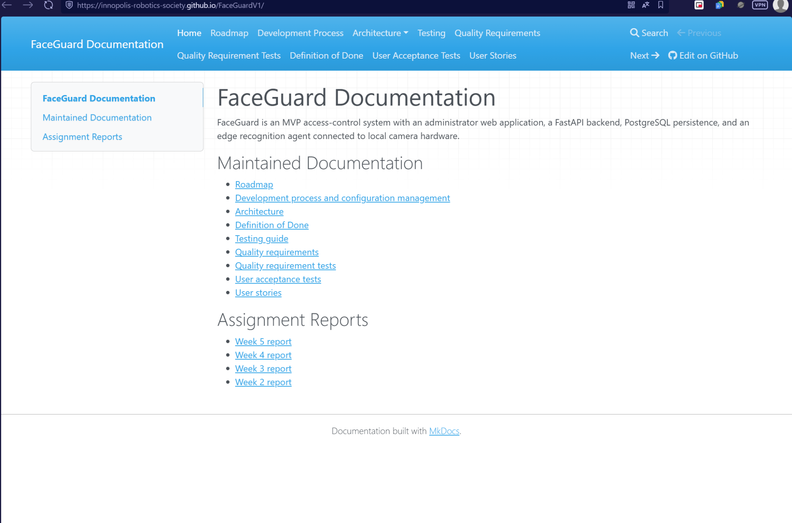
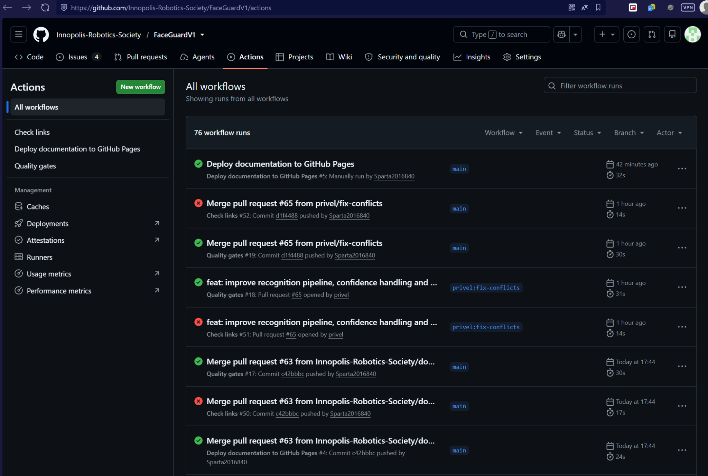
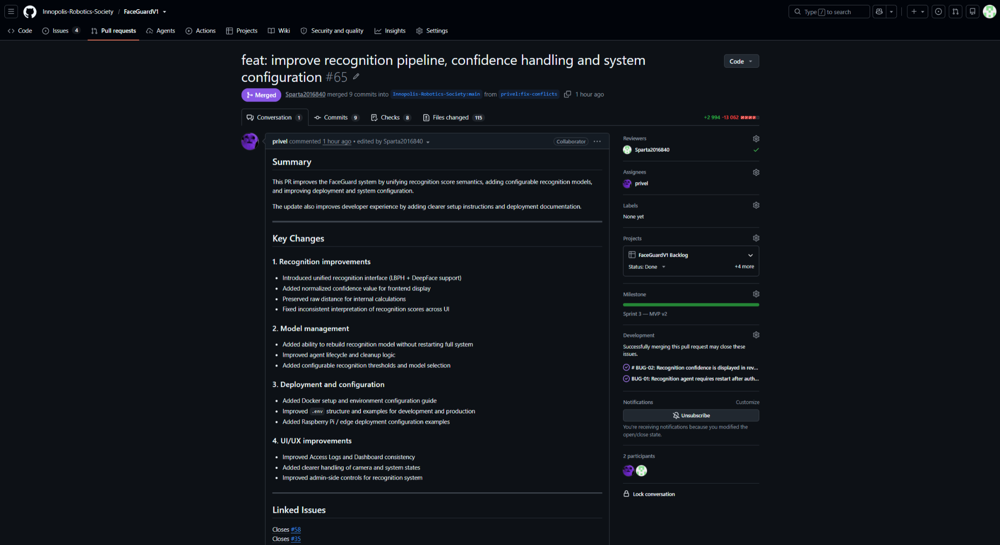
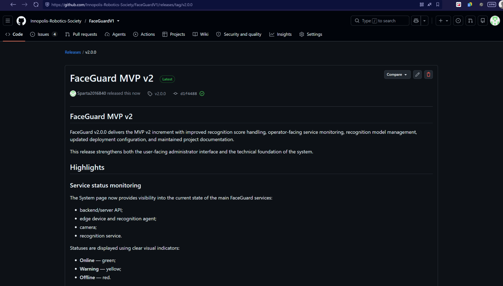
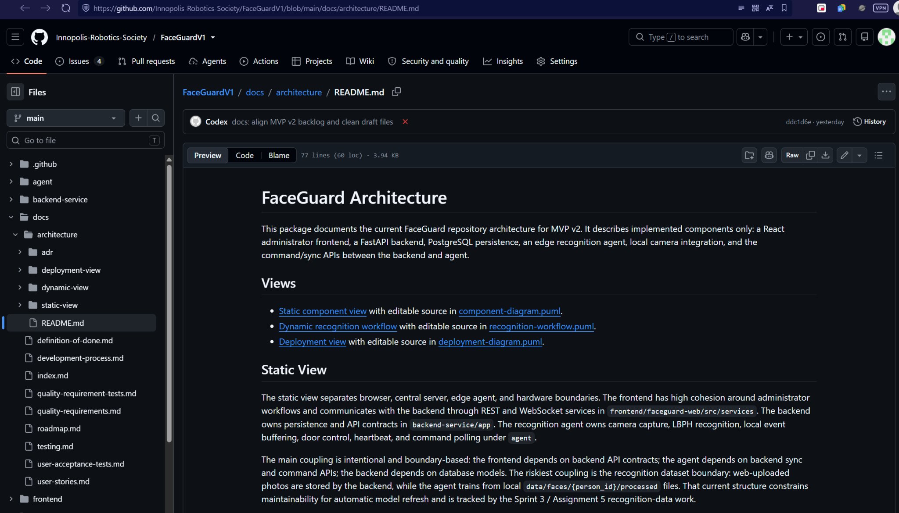
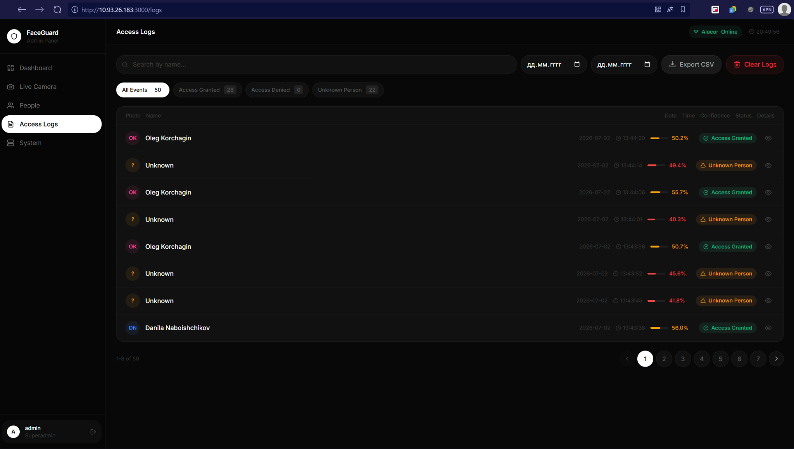
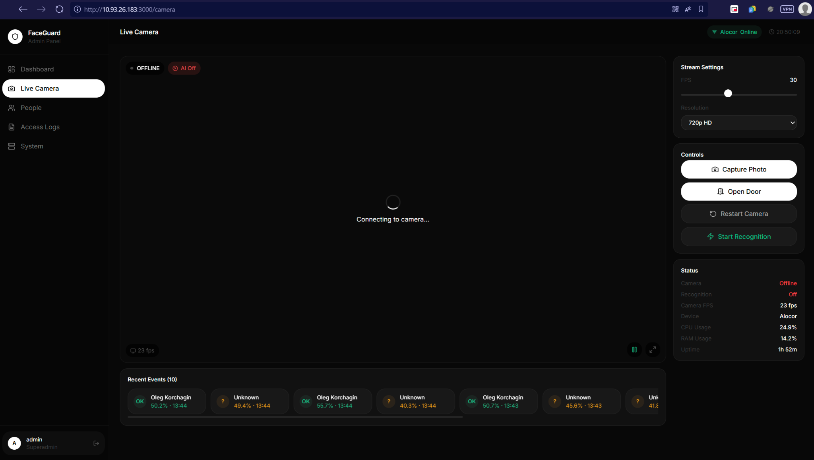
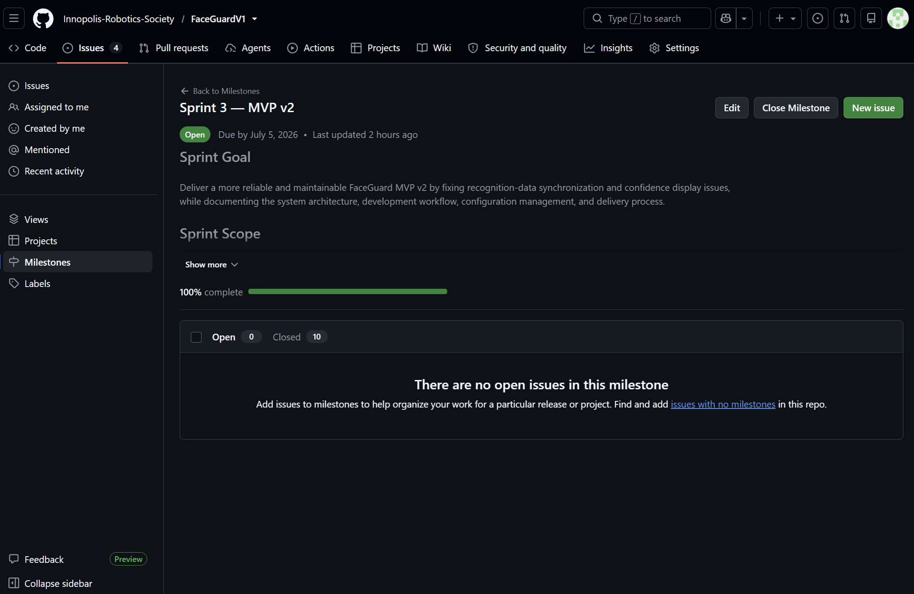
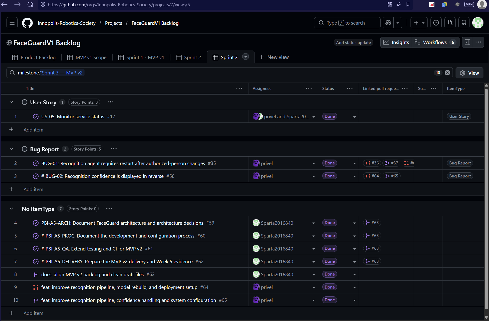
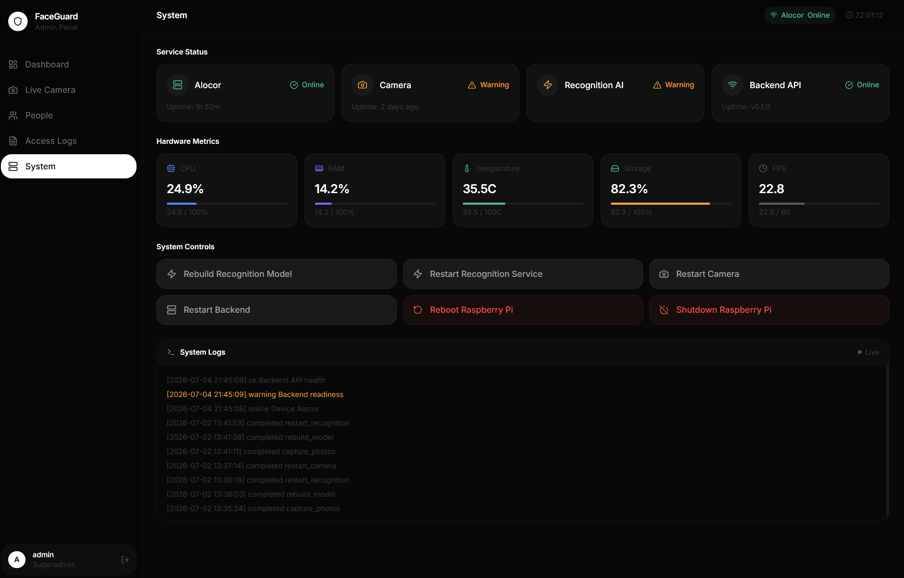

# Assignment 5 / Week 5 Report

Project: FaceGuard, an MVP access-control system combining an administrator
web app, central backend, PostgreSQL persistence, an edge recognition agent, and
local camera/door hardware integration.

## 1. Sprint 3 MVP v2 Overview

- Product Backlog board/view:
  [GitHub Project view](https://github.com/orgs/Innopolis-Robotics-Society/projects/7/views/1)
- Sprint Backlog board/view:
  [GitHub Project Sprint view](https://github.com/orgs/Innopolis-Robotics-Society/projects/7/views/2)
- Sprint milestone:
  [Sprint 3 - MVP v2](https://github.com/Innopolis-Robotics-Society/FaceGuardV1/milestone/3)
- Sprint Review date: July 4, 2026.
- Sprint Goal: document the current architecture and development process,
  extend recognition-score correctness tests, preserve the Assignment 4 quality
  baseline, and prepare truthful MVP v2 delivery evidence.
- Total selected Story Points: 27.
- Current public product access artifact:
  [repository run instructions](../../README.md#run-the-central-backend).
- Public sanitized MVP v2 demo:
  [Two-minute demo video](https://drive.google.com/file/d/1SLaFwTe7_OE0T8-UPiGuFQQmNtrOl65F/view?usp=sharing).

## 2. Selected PBIs and Scope

| Issue | Title | SP | Implementer | Reviewer | Current status |
| --- | --- | ---: | --- | --- | --- |
| [#17](https://github.com/Innopolis-Robotics-Society/FaceGuardV1/issues/17) | US-05: Monitor service status | 3 | privel | Sparta2016840 | Reviewed, merged, customer-reviewed, and closed. |
| [#59](https://github.com/Innopolis-Robotics-Society/FaceGuardV1/issues/59) | PBI-A5-ARCH: Document FaceGuard architecture and architecture decisions | 5 | Sparta2016840 | rmxqwo | Reviewed, merged, and closed. |
| [#60](https://github.com/Innopolis-Robotics-Society/FaceGuardV1/issues/60) | PBI-A5-PROC: Document the development and configuration process | 3 | Sparta2016840 | etherealboop | Reviewed, merged, and closed. |
| [#61](https://github.com/Innopolis-Robotics-Society/FaceGuardV1/issues/61) | PBI-A5-QA: Extend testing and CI for MVP v2 | 3 | Sparta2016840 | privel | Reviewed, merged, customer-UAT verified, and closed. |
| [#62](https://github.com/Innopolis-Robotics-Society/FaceGuardV1/issues/62) | PBI-A5-DELIVERY: Prepare the MVP v2 delivery and Week 5 evidence | 5 | Sparta2016840 | rmxqwo | Reviewed, merged, Sprint Review evidence added, and closed. |
| [#35](https://github.com/Innopolis-Robotics-Society/FaceGuardV1/issues/35) | BUG-01: Recognition agent requires restart after authorized-person changes | 5 | privel | Sparta2016840 | Closed for the reviewed MVP v2 model-management scope. |
| [#58](https://github.com/Innopolis-Robotics-Society/FaceGuardV1/issues/58) | BUG-02: Recognition confidence is displayed in reverse | 3 | privel | Sparta2016840 | Reviewed, merged, customer-UAT verified, and closed. |

Delivered repository-side MVP v2 changes:

- Corrected recognition-score presentation so raw OpenCV LBPH distance is not
  displayed as a fake higher-is-better confidence percentage.
- Added deterministic tests for recognition threshold boundary and UI score
  presentation.
- Added maintained architecture views and ADRs.
- Added development-process and configuration-management documentation.
- Added hosted-docs configuration and Week 5 report structure.

## 3. Customer Feedback Response

| Feedback point or product risk | Resulting PBI or issue | Status | Response |
| --- | --- | --- | --- |
| Authorized-person changes should become effective without manually restarting the recognition agent. | [#35](https://github.com/Innopolis-Robotics-Society/FaceGuardV1/issues/35), [#61](https://github.com/Innopolis-Robotics-Society/FaceGuardV1/issues/61) | MVP v2 workaround reviewed; full automatic sync remains follow-up | Customer was told that model management/restart is available through the interface. A complete automatic fix still needs reliable dataset/model sync for web-uploaded and agent-captured photos. |
| Strong and weak recognition results were confusing because raw LBPH distance was presented as confidence. | [#58](https://github.com/Innopolis-Robotics-Society/FaceGuardV1/issues/58), [#61](https://github.com/Innopolis-Robotics-Society/FaceGuardV1/issues/61) | Customer reviewed and accepted the corrected display | UI helper tests verify lower LBPH distance displays as stronger and higher distance as weaker. The customer confirmed the score display was clear during the July 4 review. |
| Architecture, workflow, and configuration-management evidence must be maintainable. | [#59](https://github.com/Innopolis-Robotics-Society/FaceGuardV1/issues/59), [#60](https://github.com/Innopolis-Robotics-Society/FaceGuardV1/issues/60) | Reviewed, merged, and closed | Added maintained docs under `docs/`, diagrams-as-code, ADRs, and development-process documentation. |
| Operators need clear service status and unavailable-camera visibility. | [#17](https://github.com/Innopolis-Robotics-Society/FaceGuardV1/issues/17), [#62](https://github.com/Innopolis-Robotics-Society/FaceGuardV1/issues/62) | Customer reviewed and accepted; US-05 closed | The System page exposes backend, edge device/camera, and recognition status from backend health and heartbeat-derived state. The customer confirmed the unavailable-camera state was clear. |

Follow-up note: the stale authorized-person model refresh risk was closed for
the reviewed MVP v2 scope through operator-facing model-management controls.
Deeper automatic dataset/model synchronization can still be considered future
hardening if the team extends the Raspberry Pi workflow.

## 4. Maintained Documentation Links

- [Roadmap](../../docs/roadmap.md)
- [Definition of Done](../../docs/definition-of-done.md)
- [Testing guide](../../docs/testing.md)
- [Quality requirements](../../docs/quality-requirements.md)
- [Quality requirement tests](../../docs/quality-requirement-tests.md)
- [User acceptance tests](../../docs/user-acceptance-tests.md)
- [Development process and configuration management](../../docs/development-process.md)
- [Architecture overview](../../docs/architecture/README.md)
- [Static architecture view](../../docs/architecture/static-view/component-diagram.svg)
- [Dynamic architecture view](../../docs/architecture/dynamic-view/recognition-workflow.svg)
- [Deployment architecture view](../../docs/architecture/deployment-view/deployment-diagram.svg)
- [ADR index](../../docs/architecture/README.md#adr-index)
- [CHANGELOG](../../CHANGELOG.md)
- Hosted documentation site:
  [FaceGuard documentation](https://innopolis-robotics-society.github.io/FaceGuardV1/)
  - Published. See screenshot evidence
    [01_hosted_documentation.png](images/01_hosted_documentation.png) and
    [02_github_actions_ci_and_pages.png](images/02_github_actions_ci_and_pages.png).

## 5. Architecture Summary

FaceGuard keeps central administration and persistence in the FastAPI backend
while the recognition agent remains close to local camera and door hardware.
The static view documents the browser, frontend, backend, database, agent, and
hardware boundary. The dynamic view documents recognition event submission. The
deployment view documents the central service host, edge recognition host, and
customer-facing browser path.

Quality-to-ADR traceability:

- [ADR-001 - Backend integration boundary](../../docs/architecture/adr/ADR-001-backend-integration-boundary.md)
  supports authentication and validation requirements.
- [ADR-002 - Recognition score semantics](../../docs/architecture/adr/ADR-002-recognition-score-semantics.md)
  supports consistent score interpretation.
- [ADR-003 - Central server and edge agent](../../docs/architecture/adr/ADR-003-central-server-and-edge-agent.md)
  supports the current hardware/deployment split.

## 6. Testing and CI Status

Automated tests added for Sprint 3 / Assignment 5:

- `test_distance_below_threshold_is_match`
- `test_distance_equal_threshold_uses_documented_boundary`
- `test_distance_above_threshold_is_not_match`
- `test_good_match_has_positive_display`
- `test_bad_match_has_negative_display`

Local validation status:

| Command | Status |
| --- | --- |
| `npm run build` in `frontend/faceguard-web` | Passed locally. |
| `npm test -- --run` in `frontend/faceguard-web` | Passed locally. |
| `pytest tests -v` in `backend-service` | Passed locally. |
| `pytest tests/qrt -m qrt -v` in `backend-service` | Passed locally. |
| `ruff check app/api/system.py app/core/security.py app/schemas/schemas.py tests scripts` | Passed locally. |
| `pytest tests -v --cov=app --cov-report=term-missing --cov-report=xml:coverage.xml --cov-report=json:coverage.json` | Passed locally. |
| `python scripts/check_critical_coverage.py coverage.json` | Passed locally. |
| `mkdocs build --strict` | Passed locally. |
| `java -jar C:\tmp\plantuml.jar -tsvg ...` | Passed locally after installing a Java-8-compatible PlantUML jar. |
| `docker compose -f backend-service/docker-compose.yml config --quiet` | Not run locally; Docker is not available in PATH. |

CI pipeline:
[Quality gates](https://github.com/Innopolis-Robotics-Society/FaceGuardV1/actions/workflows/quality.yml).

Latest protected-default-branch CI evidence: relevant `Quality gates` run and
documentation deployment are shown as passed in
[02_github_actions_ci_and_pages.png](images/02_github_actions_ci_and_pages.png).
The screenshot also contains unrelated failed `Check links` runs, so this
report does not claim that every visible workflow run passed.

## 7. Release, Demo, UAT, and Hosted Docs Evidence

- SemVer release mapped to MVP v2:
  [Release v2.0.0](https://github.com/Innopolis-Robotics-Society/FaceGuardV1/releases/tag/v2.0.0)
  is published. See [04_semver_release_v2.0.0.png](images/04_semver_release_v2.0.0.png).
- Public sanitized MVP v2 demo shorter than two minutes:
  [Two-minute demo video](https://drive.google.com/file/d/1SLaFwTe7_OE0T8-UPiGuFQQmNtrOl65F/view?usp=sharing).
- Public sanitized UAT result summary: completed in this report through
  [Sprint Review summary](sprint-review-summary.md), [Sprint Review notes](sprint-review-notes.md),
  and [UAT documentation](../../docs/user-acceptance-tests.md).
- Hosted documentation deployment: published through GitHub Pages. See
  [Hosted documentation](https://innopolis-robotics-society.github.io/FaceGuardV1/)
  and [02_github_actions_ci_and_pages.png](images/02_github_actions_ci_and_pages.png).
- Sprint Review notes: [sprint-review-notes.md](sprint-review-notes.md)
- Sprint Review summary: [sprint-review-summary.md](sprint-review-summary.md)
- Sprint Review transcript: [sprint-review-transcript.md](sprint-review-transcript.md)
  contains a sanitized public transcript. The original recording remains
  private evidence.

## 8. Week 5 Supporting Files

- [Reflection](reflection.md)
- [Retrospective](retrospective.md)
- [LLM report](llm-report.md)
- Screenshot directory: [images/](images/)

## 9. Screenshot Evidence

The repository contains ten Week 5 screenshot artifacts under
`reports/week5/images/`. These screenshots are public evidence only; private
recording links, credentials, and private access details are not included.

| Evidence | Screenshot | Status |
| --- | --- | --- |
| Hosted documentation site |  | Published |
| GitHub Pages deployment and protected-main Quality Gates |  | Relevant documentation deployment and Quality Gates runs passed |
| Reviewed issue-linked implementation PR #65 |  | Reviewed and merged |
| SemVer release v2.0.0 |  | Published |
| Maintained architecture documentation |  | Published in repository and hosted docs |
| Access Logs and confidence presentation |  | Available on the private-network deployment |
| Live Camera hardware-unavailable state |  | Graceful offline state shown |
| Sprint milestone completion |  | 100% complete; no open issues |
| GitHub Project Sprint board |  | Selected PBIs and related PRs shown as Done |
| System service statuses |  | Backend API, edge device/agent, camera, and recognition service statuses shown |

The Live Camera evidence shows the expected hardware-dependent state for the
online/private-network demonstration: the administrator interface is available,
while the camera is `Offline` and recognition is `Off`. The central connecting
state is not claimed as ideal unavailable-state UX; it is evidence that the page
remains available and reports the offline state.

## 10. Contribution Traceability

| Team member / GitHub username | Sprint 3 / Assignment 5 responsibility | Current public evidence |
| --- | --- | --- |
| Sparta2016840 | Implementer for #59, #60, #61, #62 | Implemented documentation, architecture, process, QA, and delivery updates; reviewed/merged issue evidence is complete. |
| rmxqwo | Reviewer for #59 and #62 | Review completed for architecture/delivery evidence. |
| etherealboop | Reviewer for #60 | Review completed for development-process evidence. |
| privel | Implementer for #35 and #58; reviewer for #61 | Bug-fix and QA review/merge evidence is complete. |

## 11. Current Product Status and Next Steps

Current status: repository-side MVP v2 documentation, score-semantics tests, UI
score presentation, architecture diagrams, ADRs, and hosted-docs configuration
are reviewed and merged. Sprint Review and customer-facing UAT evidence for the
demonstrated MVP v2 behavior is documented, and the selected issues, bugs, and
US-05 are closed. Hosted documentation, protected-main Quality Gates evidence,
reviewed PR #65, release v2.0.0, architecture documentation, Access Logs, and
Live Camera offline-state screenshots are included. Sprint milestone and GitHub
Project board screenshots are included. The public demo video is linked. The
System service-status screenshot is included. Public repository evidence for
Assignment 5 is complete except for private Moodle-only materials.

Next steps:

1. Prepare the Moodle PDF with private recording, UAT/Sprint Review timecodes,
   private access details, and instructor-only evidence.
2. Update release notes with the public demo link if it is not already present.

## 12. Moodle PDF Checklist

The private Moodle PDF must include team member identities, university emails,
GitHub usernames, Scrum roles, technical responsibilities, who did what,
non-participation notes, commit-hash permalinks, private Sprint Review/UAT
recording links or timecodes, exact private access instructions, limited
credentials where needed, and private consent or customer-identifying evidence.
None of that private material should be committed.
